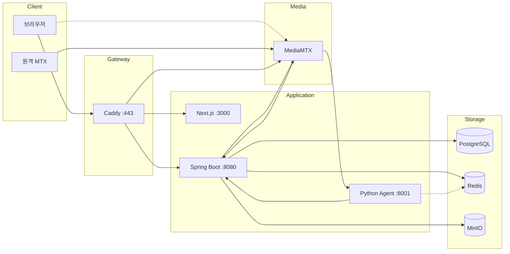
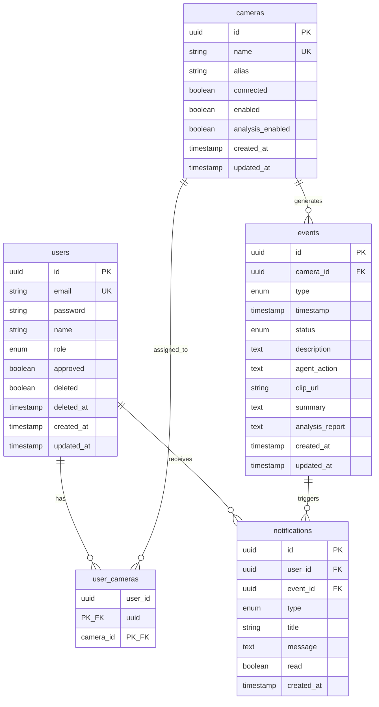

# AEGIS 워크플로우 문서

> CCTV 실시간 AI 안전 모니터링 시스템

**최종 업데이트**: 2026-01-23

---

## 1. 시스템 아키텍처

### 1.1 전체 구성



### 1.2 서비스 포트

| 서비스 | 포트 | 설명 |
|--------|------|------|
| Caddy | 443 | HTTPS 리버스 프록시 |
| Next.js | 3000 | 프론트엔드 |
| Spring Boot | 8080 | 백엔드 API |
| Python Agent | 8001 | AI 분석 |
| MediaMTX API | 9997 | 카메라 목록 조회 |
| MediaMTX WebRTC | 8889 | WHEP 시그널링 |
| MediaMTX ICE | 8189/udp | WebRTC 미디어 |
| MediaMTX HLS | 8888 | HLS 스트리밍 |
| MediaMTX SRT | 8890/udp | 스트림 수신 |
| PostgreSQL | 5432 | 데이터베이스 |
| Redis | 6379 | 캐시/토큰/Pub-Sub |
| MinIO | 9000 | 클립 스토리지 |
| MinIO Console | 9001 | 웹 관리 콘솔 |

### 1.3 Caddy 라우팅

| 경로 | 대상 |
|------|------|
| `/api/*` | Spring Boot :8080 |
| `/stream/*` | MediaMTX :8889 (prefix strip) |
| `/*` | Next.js :3000 |

### 1.4 연결 흐름

**브라우저 → 백엔드:**
1. 브라우저 → Caddy (HTTPS :443)
2. Caddy → Next.js (`/*`) 또는 Spring Boot (`/api/*`)

**WebRTC 스트리밍:**
1. 브라우저 → Spring Boot: `POST /api/cameras/{id}/stream` → 토큰 발급
2. 브라우저 → Caddy → MediaMTX: `POST /stream/{cam}/whep?token=xxx`
3. MediaMTX → Spring Boot: `POST /internal/mediamtx/auth` → 토큰 검증
4. 브라우저 ↔ MediaMTX: UDP ICE 직접 연결 (DTLS 암호화)

**카메라 동기화:**
1. 원격 MTX → MediaMTX: SRT 스트림 송출
2. MediaMTX: `runOnReady` 훅 실행
3. MediaMTX → Spring Boot: `POST /internal/mediamtx/sync`
4. Spring Boot → MediaMTX: `GET /v3/paths/list`
5. Spring Boot → PostgreSQL: 카메라 INSERT/UPDATE
6. Spring Boot → 브라우저: SSE `camera` 이벤트
7. Spring Boot → Redis: Pub/Sub `camera:analysis:update`

**AI 분석:**
1. MediaMTX → Python Agent: `POST /frame/{cameraName}` (1fps JPEG)
2. Agent: Redis `camera:analysis:update` 채널 구독
3. Agent → Spring Boot: `GET /internal/agent/cameras/analysis`
4. Agent: 분석 대상 카메라 프레임 버퍼링 (8장)
5. Agent: AI 분석 수행
6. Agent → Spring Boot: `POST /internal/agent/clips` → clipKey
7. Agent → Spring Boot: `POST /internal/agent/events` → eventId
8. Agent → Spring Boot: `PATCH /internal/agent/events/{id}/analysis`

---

## 2. 프로젝트 구조

### 2.1 백엔드 디렉토리

```
aegis-backend/src/main/java/com/aegis/aegisbackend/
├── AegisBackendApplication.java
├── domain/
│   ├── auth/
│   │   ├── controller/AuthController.java
│   │   ├── dto/AuthDto.java
│   │   └── service/AuthService.java
│   ├── camera/
│   │   ├── controller/CameraController.java
│   │   ├── dto/CameraDto.java
│   │   ├── entity/Camera.java
│   │   ├── entity/UserCamera.java
│   │   ├── repository/CameraRepository.java
│   │   ├── repository/UserCameraRepository.java
│   │   └── service/CameraService.java
│   ├── event/
│   │   ├── controller/EventController.java
│   │   ├── dto/EventDto.java
│   │   ├── entity/Event.java
│   │   ├── repository/EventRepository.java
│   │   └── service/EventService.java
│   ├── notification/
│   │   ├── controller/NotificationController.java
│   │   ├── dto/NotificationDto.java
│   │   ├── entity/Notification.java
│   │   ├── repository/NotificationRepository.java
│   │   ├── service/NotificationService.java
│   │   └── service/SseEmitterService.java
│   ├── stats/
│   │   ├── controller/StatsController.java
│   │   ├── dto/StatsDto.java
│   │   └── service/StatsService.java
│   ├── stream/
│   │   ├── dto/StreamDto.java
│   │   └── service/StreamService.java
│   └── user/
│       ├── controller/UserController.java
│       ├── dto/UserDto.java
│       ├── entity/User.java
│       ├── repository/UserRepository.java
│       └── service/UserService.java
├── global/
│   ├── common/enums/
│   │   ├── EventStatus.java
│   │   ├── EventType.java
│   │   ├── NotificationType.java
│   │   └── UserRole.java
│   ├── config/
│   │   ├── AsyncConfig.java
│   │   ├── DataInitializer.java
│   │   ├── RedisConfig.java
│   │   ├── S3Config.java
│   │   └── SecurityConfig.java
│   ├── exception/
│   │   ├── BusinessException.java
│   │   ├── ErrorCode.java
│   │   └── GlobalExceptionHandler.java
│   └── security/
│       ├── CustomUserDetailsService.java
│       ├── JwtAuthenticationFilter.java
│       └── JwtTokenProvider.java
└── infra/
    ├── agent/
    │   ├── AgentService.java
    │   ├── AgentWebhookController.java
    │   └── dto/
    │       ├── AnalysisResultRequest.java
    │       ├── ClipRequest.java
    │       └── CreateEventRequest.java
    ├── mediamtx/
    │   ├── ClipExtractionService.java
    │   ├── MediaMTXSyncService.java
    │   └── MediaMTXWebhookController.java
    ├── redis/
    │   └── RedisTokenService.java
    └── s3/
        └── S3Service.java
```

### 2.2 프론트엔드 디렉토리

```
aegis-frontend/src/
├── app/
│   ├── globals.css
│   ├── layout.tsx
│   ├── not-found.tsx
│   ├── page.tsx                    # 메인 대시보드
│   ├── providers.tsx               # React Query, Auth Provider
│   ├── auth/page.tsx               # 로그인/회원가입
│   ├── events/page.tsx             # 이벤트 목록
│   ├── members/page.tsx            # 멤버 관리 (Admin)
│   ├── settings/page.tsx           # 설정
│   └── statistics/page.tsx         # 통계
├── components/
│   ├── NavLink.tsx
│   ├── auth/AuthForm.tsx
│   ├── dashboard/
│   │   ├── CCTVGrid.tsx            # 카메라 그리드 (3x3, 페이지네이션)
│   │   ├── CameraDetailModal.tsx   # 카메라 상세 (enabled, analysisEnabled)
│   │   ├── DashboardContent.tsx
│   │   ├── EventDetailModal.tsx
│   │   ├── EventLog.tsx            # 실시간 이벤트 로그
│   │   ├── StatsDashboard.tsx
│   │   └── WebRTCPlayer.tsx
│   ├── events/EventsPageContent.tsx
│   ├── layout/
│   │   ├── DashboardLayout.tsx
│   │   ├── Header.tsx
│   │   └── ProtectedRoute.tsx
│   ├── members/MembersPageContent.tsx
│   ├── notifications/NotificationModal.tsx
│   ├── settings/SettingsPageContent.tsx
│   ├── statistics/StatisticsPageContent.tsx
│   └── ui/                         # shadcn/ui 컴포넌트
├── contexts/
│   └── AuthContext.tsx             # 전역 인증 상태
├── hooks/
│   ├── use-mobile.tsx
│   ├── use-toast.ts
│   ├── useMonitoring.ts            # React Query 래퍼
│   └── useNotificationStream.ts    # SSE 연결
├── lib/
│   ├── api.ts                      # API 함수
│   ├── axios.ts                    # Axios 인스턴스
│   ├── queryKeys.ts                # React Query 키
│   └── utils.ts
└── types/
    └── index.ts                    # TypeScript 타입
```

### 2.3 인프라 디렉토리

```
aegis-infra/
├── Caddyfile
├── docker-compose.yml
├── Dockerfile.mediamtx
├── mediamtx.yml
├── caddy_config/
├── caddy_data/
├── minio_data/
├── postgres_data/
├── recordings/                     # HLS 녹화 파일
└── redis_data/
```

---

## 3. 데이터 모델

### 3.1 ERD



### 3.2 Enum 값

**UserRole:**
| 값 | API 값 | 설명 |
|-----|--------|------|
| ADMIN | "admin" | 관리자 (모든 권한) |
| USER | "user" | 일반 사용자 (할당 카메라만) |

**EventType:**
| 값 | API 값 | 설명 |
|-----|--------|------|
| ASSAULT | "assault" | 폭행 |
| BURGLARY | "burglary" | 절도 |
| DUMP | "dump" | 투기 |
| SWOON | "swoon" | 실신 |
| VANDALISM | "vandalism" | 파손 |

**EventStatus:**
| 값 | API 값 | 설명 |
|-----|--------|------|
| PROCESSING | "processing" | 분석 중 |
| RESOLVED | "resolved" | 완료 |

**NotificationType:**
| 값 | API 값 | 설명 |
|-----|--------|------|
| ALERT | "alert" | 긴급 (폭행, 절도) |
| WARNING | "warning" | 경고 (투기, 실신, 파손) |
| INFO | "info" | 정보 |
| SUCCESS | "success" | 성공 |

### 3.3 인덱스

**users:**
- `idx_users_email` (email)
- `idx_users_approved` (approved)

**cameras:**
- `idx_cameras_connected` (connected)
- `idx_cameras_enabled` (enabled)
- `idx_cameras_analysis_enabled` (analysis_enabled)

**events:**
- `idx_events_camera_id` (camera_id)
- `idx_events_type` (type)
- `idx_events_status` (status)
- `idx_events_timestamp` (timestamp)

**notifications:**
- `idx_notifications_user_id` (user_id)
- `idx_notifications_user_read` (user_id, read)
- `idx_notifications_created_at` (created_at)

### 3.4 Redis 키

| 키 패턴 | 값 | TTL |
|---------|----|----|
| `refresh_token:{token}` | userId | 7일 |
| `stream_token:{token}` | userId:cameraId | 30초 |
| `mediamtx:sync:lock` | "locked" | 1초 |

**Pub/Sub 채널:**
| 채널 | 메시지 | 구독자 |
|------|--------|--------|
| `camera:analysis:update` | "update" | Python Agent |

### 3.5 MinIO 버킷

```
files/
└── clips/
    └── {clipId}/
        └── clip.mp4
```

---

## 4. Spring Security

### 4.1 SecurityConfig 규칙

| 경로 | 권한 |
|------|------|
| `/api/auth/login` | 인증 불필요 |
| `/api/auth/signup` | 인증 불필요 |
| `/api/auth/refresh` | 인증 불필요 |
| `/internal/**` | 인증 불필요 (내부망) |
| `/api/users/**` | ADMIN 역할 필요 |
| 그 외 | 인증 필요 |

### 4.2 JWT 설정

| 설정 | 값 |
|------|-----|
| Access Token TTL | 15분 (900000ms) |
| Refresh Token TTL | 7일 (604800000ms) |
| 알고리즘 | HS256 |
| 저장소 | Access: 메모리, Refresh: Redis + HttpOnly Cookie |

### 4.3 인증 흐름

1. 로그인 → Access Token (응답 body) + Refresh Token (Redis + Cookie)
2. API 호출 → `Authorization: Bearer {accessToken}`
3. 401 응답 → Refresh Token으로 갱신 시도
4. 갱신 실패 → `/auth`로 리다이렉트

---

## 5. 에러 코드

### 5.1 Auth 에러

| 코드 | HTTP | 메시지 |
|------|------|--------|
| EMAIL_NOT_FOUND | 401 | 등록되지 않은 이메일입니다. |
| INVALID_PASSWORD | 401 | 비밀번호가 일치하지 않습니다. |
| USER_NOT_APPROVED | 403 | 관리자 승인 대기 중입니다. |
| DUPLICATE_EMAIL | 400 | 이미 등록된 이메일입니다. |
| REFRESH_TOKEN_NOT_FOUND | 401 | Refresh token이 없습니다. |
| INVALID_REFRESH_TOKEN | 401 | 유효하지 않은 refresh token입니다. |
| INVALID_USER | 401 | 유효하지 않은 사용자입니다. |
| AUTHENTICATION_REQUIRED | 401 | 인증이 필요합니다. |
| USER_NOT_FOUND | 401 | 사용자를 찾을 수 없습니다. |
| CURRENT_PASSWORD_MISMATCH | 400 | 현재 비밀번호가 일치하지 않습니다. |
| PASSWORD_TOO_SHORT | 400 | 새 비밀번호는 6자 이상이어야 합니다. |
| USER_DELETED | 403 | 탈퇴한 계정입니다. |

### 5.2 User 에러

| 코드 | HTTP | 메시지 |
|------|------|--------|
| USER_ID_REQUIRED | 400 | 사용자 ID가 필요합니다. |
| USER_NOT_FOUND_BY_ID | 404 | 사용자를 찾을 수 없습니다. |

### 5.3 Camera 에러

| 코드 | HTTP | 메시지 |
|------|------|--------|
| CAMERA_NOT_FOUND | 404 | 카메라를 찾을 수 없습니다. |
| CAMERA_ACCESS_DENIED | 403 | 해당 카메라에 대한 접근 권한이 없습니다. |
| CAMERA_NOT_CONNECTED | 400 | 카메라가 연결되어 있지 않습니다. |
| CAMERA_NOT_ACTIVE | 400 | 카메라가 비활성화 상태입니다. |

### 5.4 Event 에러

| 코드 | HTTP | 메시지 |
|------|------|--------|
| EVENT_NOT_FOUND | 404 | 이벤트를 찾을 수 없습니다. |

### 5.5 Notification 에러

| 코드 | HTTP | 메시지 |
|------|------|--------|
| NOTIFICATION_NOT_FOUND | 404 | 알림을 찾을 수 없습니다. |

### 5.6 Storage 에러

| 코드 | HTTP | 메시지 |
|------|------|--------|
| S3_UPLOAD_FAILED | 500 | S3 업로드에 실패했습니다. |
| S3_DOWNLOAD_FAILED | 500 | S3 다운로드에 실패했습니다. |
| S3_DELETE_FAILED | 500 | S3 삭제에 실패했습니다. |
| CLIP_EXTRACTION_FAILED | 500 | 클립 추출에 실패했습니다. |
| CAMERA_NOT_FOUND_FOR_CLIP | 404 | 클립 추출을 위한 카메라를 찾을 수 없습니다. |

### 5.7 General 에러

| 코드 | HTTP | 메시지 |
|------|------|--------|
| FORBIDDEN | 403 | 권한이 없습니다. |
| INTERNAL_SERVER_ERROR | 500 | 서버 내부 오류가 발생했습니다. |

---

## 6. API 명세

### 6.1 Auth API

#### POST /api/auth/login
로그인

**Request:**
| 필드 | 타입 | 필수 | 설명 |
|------|------|------|------|
| email | string | O | 이메일 |
| password | string | O | 비밀번호 |

**Response:** `200 OK`
| 필드 | 타입 | 설명 |
|------|------|------|
| accessToken | string | JWT 액세스 토큰 |
| user | User | 사용자 정보 |

**Cookie:** `refreshToken` (HttpOnly, Secure, 7일)

**에러:** EMAIL_NOT_FOUND, INVALID_PASSWORD, USER_NOT_APPROVED, USER_DELETED

---

#### POST /api/auth/signup
회원가입

**Request:**
| 필드 | 타입 | 필수 | 설명 |
|------|------|------|------|
| email | string | O | 이메일 |
| password | string | O | 비밀번호 |
| name | string | O | 이름 |

**Response:** `200 OK`
| 필드 | 타입 | 설명 |
|------|------|------|
| success | boolean | true |
| message | string | "회원가입이 완료되었습니다. 관리자 승인 후 로그인이 가능합니다." |

**에러:** DUPLICATE_EMAIL

---

#### POST /api/auth/logout
로그아웃 (인증 필요)

**Response:** `200 OK`
| 필드 | 타입 | 설명 |
|------|------|------|
| success | boolean | true |

---

#### POST /api/auth/refresh
토큰 갱신

**Cookie:** `refreshToken` 필요

**Response:** `200 OK`
| 필드 | 타입 | 설명 |
|------|------|------|
| accessToken | string | 새 JWT 액세스 토큰 |

**에러:** REFRESH_TOKEN_NOT_FOUND, INVALID_REFRESH_TOKEN

---

#### GET /api/auth/me
내 정보 조회 (인증 필요)

**Response:** `200 OK` → User

---

#### PATCH /api/auth/me
프로필 수정 (인증 필요)

**Request:**
| 필드 | 타입 | 필수 | 설명 |
|------|------|------|------|
| name | string | O | 새 이름 |

**Response:** `200 OK` → User

---

#### DELETE /api/auth/me
회원탈퇴 (인증 필요, 소프트 삭제)

**Response:** `200 OK`
| 필드 | 타입 | 설명 |
|------|------|------|
| success | boolean | true |
| message | string | "회원탈퇴가 완료되었습니다." |

---

#### PATCH /api/auth/password
비밀번호 변경 (인증 필요)

**Request:**
| 필드 | 타입 | 필수 | 설명 |
|------|------|------|------|
| currentPassword | string | O | 현재 비밀번호 |
| newPassword | string | O | 새 비밀번호 |

**Response:** `200 OK`
| 필드 | 타입 | 설명 |
|------|------|------|
| success | boolean | true |
| message | string | "비밀번호가 변경되었습니다." |

**에러:** CURRENT_PASSWORD_MISMATCH, PASSWORD_TOO_SHORT

---

### 6.2 Camera API

#### GET /api/cameras
카메라 목록 조회 (인증 필요)

**정렬:** connected DESC → enabled DESC → alias ASC

**권한:** ADMIN은 전체, USER는 할당된 카메라만

**Response:** `200 OK` → Camera[]

---

#### GET /api/cameras/{id}
카메라 상세 조회 (인증 필요)

**Response:** `200 OK` → Camera

**에러:** CAMERA_NOT_FOUND

---

#### PATCH /api/cameras/{id}
카메라 수정 (인증 필요)

**Request:**
| 필드 | 타입 | 필수 | 설명 |
|------|------|------|------|
| alias | string | X | 별칭 |
| enabled | boolean | X | 활성화 (false시 analysisEnabled도 false) |
| analysisEnabled | boolean | X | AI 분석 활성화 (enabled=true일 때만) |

**Response:** `200 OK` → Camera

**Side Effect:**
- enabled/analysisEnabled 변경 시 → Redis Pub/Sub 발행
- SSE `camera` 이벤트 브로드캐스트

---

#### POST /api/cameras/{id}/stream
스트림 토큰 발급 (인증 필요)

**Response:** `200 OK`
| 필드 | 타입 | 설명 |
|------|------|------|
| streamUrl | string | WebRTC WHEP URL (/stream/{cam}/whep) |
| token | string | 일회용 토큰 (30초) |
| cameraId | string | 카메라 ID |
| cameraName | string | 카메라 별칭 |

**에러:** CAMERA_NOT_FOUND, CAMERA_ACCESS_DENIED, CAMERA_NOT_CONNECTED

---

### 6.3 Event API

#### GET /api/events
이벤트 목록 조회 (인증 필요)

**Response:** `200 OK` → Event[]

---

#### GET /api/events/{id}
이벤트 상세 조회 (인증 필요)

**Response:** `200 OK` → Event

**에러:** EVENT_NOT_FOUND

---

#### POST /api/events
이벤트 생성 (인증 필요)

**Request:**
| 필드 | 타입 | 필수 | 설명 |
|------|------|------|------|
| cameraId | string | O | 카메라 ID |
| type | string | O | 이벤트 타입 |
| timestamp | string | X | ISO8601 (기본: 현재) |
| description | string | X | 설명 |
| agentAction | string | X | 권장 조치 |
| summary | string | X | 요약 |
| analysisReport | string | X | 분석 리포트 |
| clipData | byte[] | X | 클립 데이터 |

**Response:** `200 OK` → Event

---

#### PATCH /api/events/{id}/status
이벤트 상태 변경 (인증 필요)

**Request:**
| 필드 | 타입 | 필수 | 설명 |
|------|------|------|------|
| status | string | O | "processing" 또는 "resolved" |

**Response:** `200 OK` → Event

---

#### GET /api/events/{id}/clip
클립 다운로드 (인증 필요)

**Response:** `200 OK`
- Content-Type: video/mp4
- Content-Disposition: attachment; filename="event_{id}.mp4"

---

#### GET /api/events/{id}/clip/stream
클립 스트리밍 (인증 필요, Range 지원)

**Request Header:**
| 헤더 | 설명 |
|------|------|
| Range | bytes=start-end (선택) |

**Response:** `200 OK` 또는 `206 Partial Content`
- Content-Type: video/mp4
- Accept-Ranges: bytes
- Content-Range: bytes start-end/total (206일 때)

---

### 6.4 Notification API

#### GET /api/notifications
알림 목록 조회 (인증 필요)

**Response:** `200 OK` → Notification[]

---

#### GET /api/notifications/stream
SSE 스트림 연결 (인증 필요)

**Response:** `200 OK` (text/event-stream)

**이벤트:**
| 이벤트 | 데이터 | 범위 | 설명 |
|--------|--------|------|------|
| connect | "SSE 연결 성공" | 개별 | 연결 확인 |
| notification | Notification (JSON) | 개별 | 새 알림 |
| camera | Camera 또는 "refresh" | 전체 | 카메라 변경 |
| event | Event (JSON) | 전체 | 이벤트 변경 |
| member | User (JSON) | 전체 | 멤버 변경 |

---

#### GET /api/notifications/unread-count
읽지 않은 알림 수 (인증 필요)

**Response:** `200 OK`
| 필드 | 타입 | 설명 |
|------|------|------|
| count | number | 읽지 않은 수 |

---

#### PATCH /api/notifications/{id}/read
알림 읽음 처리 (인증 필요)

**Response:** `200 OK` → Notification

---

#### POST /api/notifications/read-all
전체 읽음 처리 (인증 필요)

**Response:** `200 OK`
| 필드 | 타입 | 설명 |
|------|------|------|
| success | boolean | true |

---

#### DELETE /api/notifications/{id}
알림 삭제 (인증 필요)

**Response:** `200 OK`
| 필드 | 타입 | 설명 |
|------|------|------|
| success | boolean | true |

---

### 6.5 Stats API

#### GET /api/stats
통계 조회 (인증 필요)

**Query:**
| 파라미터 | 값 | 설명 |
|----------|-----|------|
| type | 없음 | 전체 통계 |
| type | daily | 최근 7일 일별 |
| type | event-types | 유형별 분포 |
| type | monthly | 월별 캘린더 |

**Response (type 없음):** `200 OK`
| 필드 | 타입 | 설명 |
|------|------|------|
| daily | DailyStat[] | 일별 통계 |
| eventTypes | EventTypeStat[] | 유형별 통계 |
| monthly | Map<string, MonthlyData> | 월별 통계 |

---

### 6.6 User API (Admin 전용)

#### GET /api/users
사용자 목록 조회

**Response:** `200 OK` → User[]

---

#### GET /api/users/{id}
사용자 상세 조회

**Response:** `200 OK` → User

**에러:** USER_NOT_FOUND_BY_ID

---

#### PATCH /api/users/{id}
사용자 수정

**Request:**
| 필드 | 타입 | 필수 | 설명 |
|------|------|------|------|
| name | string | X | 이름 |
| role | string | X | "user" 또는 "admin" |
| assignedCameras | string[] | X | 할당 카메라 ID 목록 |

**Response:** `200 OK` → User

**Side Effect:** SSE `member` 이벤트 브로드캐스트

---

#### DELETE /api/users/{id}
사용자 삭제

**Response:** `200 OK`
| 필드 | 타입 | 설명 |
|------|------|------|
| success | boolean | true |

**Side Effect:** SSE `member` 이벤트 브로드캐스트

---

#### PATCH /api/users/{id}/approve
사용자 승인

**Response:** `200 OK` → User

**Side Effect:** SSE `member` 이벤트 브로드캐스트

---

### 6.7 Internal API (내부망)

#### POST /internal/mediamtx/sync
카메라 동기화 트리거 (MediaMTX → Spring)

**Request:** 아무 JSON (또는 빈 body)

**Response:** `200 OK`
| 필드 | 타입 | 설명 |
|------|------|------|
| success | boolean | true |

**로직:**
1. Redis `mediamtx:sync:lock` 잠금 확인
2. 잠금 획득 → 1초 대기 (연속 이벤트 병합)
3. MediaMTX `GET /v3/paths/list` 호출
4. 새 카메라: `connected=true, enabled=false, analysisEnabled=false`
5. 기존 카메라: `connected` 상태만 업데이트
6. 변경 시 SSE `camera: "refresh"` 브로드캐스트
7. 변경 시 Redis Pub/Sub `camera:analysis:update` 발행

---

#### POST /internal/mediamtx/auth
스트림 인증 검증 (MediaMTX → Spring)

**Request:**
| 필드 | 타입 | 설명 |
|------|------|------|
| user | string | Basic Auth 사용자 |
| password | string | Basic Auth 비밀번호 |
| ip | string | 클라이언트 IP |
| action | string | "read" 또는 "publish" |
| path | string | 스트림 경로 |
| protocol | string | "webrtc", "hls", "rtsp" |
| id | string | 연결 ID |
| query | string | 쿼리스트링 |
| jwt | string | JWT 토큰 |

**Response:**
- `200 OK`: 인증 성공
- `401 Unauthorized`: 인증 실패

**로직:**
- action=publish: 항상 통과 (MediaMTX 내부 인증)
- protocol=rtsp/hls: 항상 통과 (내부 사용)
- protocol=webrtc, action=read: 토큰 검증 (query에서 `token=` 추출)
  - Redis에서 `stream_token:{token}` 조회 및 삭제 (일회용)

---

#### GET /internal/agent/cameras/analysis
분석 대상 카메라 조회 (Agent → Spring)

**Response:** `200 OK`
| 필드 | 타입 | 설명 |
|------|------|------|
| cameras | AnalysisCamera[] | enabled && analysisEnabled인 카메라 |

**AnalysisCamera:**
| 필드 | 타입 | 설명 |
|------|------|------|
| id | string | 카메라 ID |
| name | string | 카메라 이름 |
| enabled | boolean | 활성화 |
| analysisEnabled | boolean | 분석 활성화 |

---

#### POST /internal/agent/clips
클립 추출 (Agent → Spring)

**Request:**
| 필드 | 타입 | 필수 | 설명 |
|------|------|------|------|
| cameraId | UUID | O | 카메라 ID |
| segmentCount | number | X | 세그먼트 수 (기본: 10) |

**Response:** `200 OK`
| 필드 | 타입 | 설명 |
|------|------|------|
| clipKey | string | MinIO 저장 키 (clips/{uuid}/clip.mp4) |
| cameraId | string | 카메라 ID |

**로직:**
1. MediaMTX HLS `GET /{camera}/index.m3u8` 파싱
2. 최신 N개 .ts 세그먼트 HTTP 다운로드
3. FFmpeg `-f concat`으로 MP4 변환
4. MinIO `clips/{uuid}/clip.mp4`에 업로드
5. 임시 파일 정리

---

#### POST /internal/agent/events
이벤트 생성 (Agent → Spring)

**Request:**
| 필드 | 타입 | 필수 | 설명 |
|------|------|------|------|
| cameraId | UUID | O | 카메라 ID |
| eventType | string | O | assault/burglary/dump/swoon/vandalism |
| description | string | X | 설명 |
| clipKey | string | X | 클립 키 |
| timestamp | string | X | ISO8601 (기본: 현재) |

**Response:** `201 Created`
| 필드 | 타입 | 설명 |
|------|------|------|
| eventId | string | 이벤트 ID |
| status | string | "processing" |

**Side Effect:**
1. DB에 Event 저장 (status=PROCESSING)
2. 카메라 권한 있는 사용자에게 Notification 생성
3. SSE `notification` 개별 전송
4. SSE `event` 전체 브로드캐스트

---

#### PATCH /internal/agent/events/{id}/analysis
분석 결과 추가 (Agent → Spring)

**Request:**
| 필드 | 타입 | 필수 | 설명 |
|------|------|------|------|
| agentAction | string | X | 권장 조치 |
| summary | string | X | 요약 |
| analysisReport | string | X | 상세 리포트 |

**Response:** `200 OK`
| 필드 | 타입 | 설명 |
|------|------|------|
| eventId | string | 이벤트 ID |
| status | string | "resolved" |

**Side Effect:**
1. Event 업데이트 (status=RESOLVED)
2. SSE `event` 전체 브로드캐스트

---

## 7. DTO 정의

### 7.1 User

| 필드 | 타입 | 설명 |
|------|------|------|
| id | string | UUID |
| email | string | 이메일 |
| name | string | 이름 |
| role | "user" \| "admin" | 역할 |
| assignedCameras | string[] | 할당된 카메라 ID |
| createdAt | string | 생성일 (ISO8601) |
| approved | boolean | 승인 여부 |

### 7.2 Camera

| 필드 | 타입 | 설명 |
|------|------|------|
| id | string | UUID |
| name | string | MediaMTX 스트림 이름 |
| alias | string | 사용자 지정 별칭 |
| connected | boolean | MediaMTX 연결 상태 |
| enabled | boolean | 메인 활성화 스위치 |
| analysisEnabled | boolean | AI 분석 활성화 |

### 7.3 Event

| 필드 | 타입 | 설명 |
|------|------|------|
| id | string | UUID |
| cameraId | string | 카메라 ID |
| cameraName | string | 카메라 별칭 |
| type | string | 이벤트 타입 |
| timestamp | string | 발생 시각 (ISO8601) |
| status | "processing" \| "resolved" | 상태 |
| description | string | 설명 |
| agentAction | string? | 권장 조치 |
| clipUrl | string? | 클립 키 |
| summary | string? | 요약 |
| analysisReport | string? | 상세 리포트 |

### 7.4 Notification

| 필드 | 타입 | 설명 |
|------|------|------|
| id | string | UUID |
| type | "alert" \| "warning" \| "info" \| "success" | 타입 |
| title | string | 제목 |
| message | string | 내용 |
| timestamp | string | 생성일 (ISO8601) |
| read | boolean | 읽음 여부 |
| eventId | string? | 연결된 이벤트 ID |

### 7.5 DailyStat

| 필드 | 타입 | 설명 |
|------|------|------|
| day | string | 날짜 |
| events | number | 이벤트 수 |
| resolved | number | 해결된 수 |

### 7.6 EventTypeStat

| 필드 | 타입 | 설명 |
|------|------|------|
| type | string | 이벤트 타입 |
| count | number | 개수 |
| color | string | 차트 색상 |

### 7.7 MonthlyData

| 필드 | 타입 | 설명 |
|------|------|------|
| events | number | 이벤트 수 |
| alerts | number | 알림 수 |

### 7.8 StreamAccessResponse

| 필드 | 타입 | 설명 |
|------|------|------|
| streamUrl | string | WebRTC WHEP URL |
| token | string | 일회용 토큰 (30초) |
| cameraId | string | 카메라 ID |
| cameraName | string | 카메라 별칭 |

---

## 8. 프론트엔드

### 8.1 페이지 구조

| 경로 | 컴포넌트 | 설명 | 권한 |
|------|----------|------|------|
| `/` | DashboardContent | 메인 대시보드 (CCTV 그리드, 이벤트 로그) | 인증 |
| `/auth` | AuthForm | 로그인/회원가입 | 미인증 |
| `/events` | EventsPageContent | 이벤트 목록 및 상세 | 인증 |
| `/members` | MembersPageContent | 멤버 관리 | Admin |
| `/settings` | SettingsPageContent | 설정 (프로필, 비밀번호) | 인증 |
| `/statistics` | StatisticsPageContent | 통계 대시보드 | 인증 |

### 8.2 AuthContext

**상태:**
| 필드 | 타입 | 설명 |
|------|------|------|
| user | User \| null | 현재 사용자 |
| isLoading | boolean | 로딩 상태 |
| isAdmin | boolean | user?.role === 'admin' |

**메서드:**
| 메서드 | 설명 |
|--------|------|
| login(email, password) | 로그인 → 성공 시 user 설정 |
| signup(email, password, name) | 회원가입 |
| logout() | 로그아웃 → user 초기화, /auth 리다이렉트 |

**초기화:**
1. 앱 로드 시 `POST /api/auth/refresh` 시도
2. 성공 → `GET /api/auth/me` → user 설정
3. 실패 → user = null

### 8.3 Axios 인터셉터

**요청 인터셉터:**
- Access Token이 있으면 `Authorization: Bearer {token}` 헤더 추가

**응답 인터셉터 (401 처리):**
1. 401 응답 && 재시도 아님 && 인증 엔드포인트 아님
2. `POST /api/auth/refresh` 시도
3. 성공 → Access Token 갱신 → 원래 요청 재시도
4. 실패 → Access Token 초기화 → `/auth` 리다이렉트

### 8.4 React Query 키

| 키 | 용도 |
|-----|------|
| `['streams']` | 카메라 목록 |
| `['streams', id]` | 카메라 상세 |
| `['eventLogs']` | 이벤트 목록 |
| `['eventLogs', id]` | 이벤트 상세 |
| `['eventLogs', filter]` | 필터링된 이벤트 |
| `['stats']` | 전체 통계 |
| `['stats', 'daily']` | 일별 통계 |
| `['stats', 'monthly']` | 월별 통계 |
| `['stats', 'summary']` | 요약 통계 |

### 8.5 Custom Hooks

**useNotificationStream(onNotification?, onCameraUpdate?, onEventUpdate?, onMemberUpdate?):**
- `@microsoft/fetch-event-source` 사용 (Authorization 헤더 지원)
- 로그인 상태에서 자동 연결
- 새 알림 수신 시 토스트 표시
- 연결 끊김 시 자동 재연결

**useStreams():**
- React Query 래퍼
- `camerasApi.getAll()` 호출

**useEventLogs():**
- React Query 래퍼
- `eventsApi.getAll()` 호출

### 8.6 API 클라이언트

**authApi:**
| 메서드 | 설명 |
|--------|------|
| login | 로그인 |
| signup | 회원가입 |
| logout | 로그아웃 |
| refresh | 토큰 갱신 |
| me | 내 정보 |
| changePassword | 비밀번호 변경 |
| updateProfile | 프로필 수정 |
| deleteAccount | 회원탈퇴 |

**camerasApi:**
| 메서드 | 설명 |
|--------|------|
| getAll | 카메라 목록 |
| getById | 카메라 상세 |
| update | 카메라 수정 |
| requestStream | 스트림 토큰 발급 |

**eventsApi:**
| 메서드 | 설명 |
|--------|------|
| getAll | 이벤트 목록 |
| getById | 이벤트 상세 |
| updateStatus | 상태 변경 |
| getClipDownloadUrl | 클립 다운로드 URL |
| getClipStreamUrl | 클립 스트리밍 URL |

**notificationsApi:**
| 메서드 | 설명 |
|--------|------|
| getAll | 알림 목록 |
| getUnreadCount | 읽지 않은 수 |
| markAsRead | 읽음 처리 |
| markAllAsRead | 전체 읽음 |
| delete | 삭제 |

**statsApi:**
| 메서드 | 설명 |
|--------|------|
| getDaily | 일별 통계 |
| getEventTypes | 유형별 통계 |
| getMonthly | 월별 통계 |

**usersApi:**
| 메서드 | 설명 |
|--------|------|
| getAll | 사용자 목록 |
| getById | 사용자 상세 |
| update | 사용자 수정 |
| delete | 사용자 삭제 |
| approve | 사용자 승인 |

---

## 9. MediaMTX 설정

### 9.1 프로토콜

| 프로토콜 | 포트 | 용도 |
|----------|------|------|
| SRT | 8890/udp | 원격 MTX에서 스트림 수신 |
| WebRTC WHEP | 8889 | 시그널링 |
| WebRTC ICE | 8189/udp | 미디어 |
| HLS | 8888 | 클립 추출, 웹 재생 |
| RTSP | 8554 | 내부 스트림 재생 (FFmpeg 소스) |
| API | 9997 | 카메라 목록 |

### 9.2 HLS 녹화

| 설정 | 값 | 설명 |
|------|-----|------|
| hlsSegmentCount | 10 | 유지 세그먼트 수 |
| hlsSegmentDuration | 3s | 세그먼트 길이 |
| hlsPartDuration | 200ms | LL-HLS 파트 길이 |
| hlsSegmentMaxSize | 50M | 세그먼트 최대 크기 |
| hlsDirectory | /recordings | 저장 경로 |

→ 3초 × 10개 = 최근 30초 보관

### 9.3 인증

**송출 인증 (authInternalUsers):**
| 사용자 | 비밀번호 | 권한 |
|--------|----------|------|
| aegis | trillion | publish, read, playback |

**시청 인증 (authHTTPAddress):**
- `POST http://host.docker.internal:8080/internal/mediamtx/auth`

### 9.4 스트림 훅

**runOnReady (스트림 시작 시):**
1. `curl -X POST /internal/mediamtx/sync` (동기화 트리거)
2. FFmpeg 루프: 1fps 프레임 추출 → Agent 전송
   - `ffmpeg -i rtsp://localhost:8554/$MTX_PATH -vframes 1 ...`
   - `curl -X POST $AGENT_URL/frame/$MTX_PATH`

**runOnNotReady (스트림 종료 시):**
- `curl -X POST /internal/mediamtx/sync` (동기화 트리거)

### 9.5 WebRTC 설정

| 설정 | 값 | 설명 |
|------|-----|------|
| webrtcICEHostNAT1To1IPs | [127.0.0.1] | ICE 후보 IP (개발용) |
| webrtcICEUDPMuxAddress | :8189 | UDP 멀티플렉싱 |

**주의:** H264 인코딩 시 B-frame 비활성화 필수 (`-tune zerolatency` 또는 `-profile:v baseline`)

---

## 10. Docker Compose

### 10.1 서비스

| 서비스 | 이미지 | 포트 | 설명 |
|--------|--------|------|------|
| caddy | caddy:latest | 443 | HTTPS 리버스 프록시, 자동 TLS |
| mediamtx | aegis-mediamtx:latest | 8890/udp, 8889, 8189/udp, 8888, 9997 | 미디어 스트리밍 |
| postgres | postgres:latest | 5432 | 데이터베이스 |
| redis | redis:latest | 6379 | 캐시/토큰/Pub-Sub |
| minio | minio/minio:latest | 9000, 9001 | 오브젝트 스토리지 |
| createbuckets | minio/mc:latest | - | 버킷 자동 생성 (초기화 후 종료) |

### 10.2 네트워크

- `aegis`: 모든 서비스 연결
- `host.docker.internal:host-gateway`: 호스트 머신 접근

### 10.3 볼륨

| 서비스 | 볼륨 |
|--------|------|
| caddy | ./Caddyfile, ./caddy_data, ./caddy_config |
| mediamtx | ./mediamtx.yml, ./recordings |
| postgres | ./postgres_data |
| redis | ./redis_data |
| minio | ./minio_data |

---

## 11. 환경 변수

### 11.1 백엔드 (application.properties)

| 변수 | 기본값 | 설명 |
|------|--------|------|
| spring.datasource.url | jdbc:postgresql://localhost:5432/aegis | DB URL |
| spring.datasource.username | aegis | DB 사용자 |
| spring.datasource.password | trillion | DB 비밀번호 |
| spring.data.redis.host | localhost | Redis 호스트 |
| spring.data.redis.port | 6379 | Redis 포트 |
| aws.s3.endpoint | http://localhost:9000 | MinIO 주소 |
| aws.s3.access-key | aegis | MinIO 키 |
| aws.s3.secret-key | trillion | MinIO 시크릿 |
| aws.s3.bucket | files | 버킷 이름 |
| aws.s3.region | us-east-1 | 리전 |
| jwt.secret | (256비트 이상) | JWT 서명 키 |
| jwt.access-expiration | 900000 | Access Token TTL (15분) |
| jwt.refresh-expiration | 604800000 | Refresh Token TTL (7일) |
| mediamtx.api-url | http://localhost:9997 | MediaMTX API |
| mediamtx.webrtc-url | /stream | WebRTC 기본 경로 |
| mediamtx.hls-url | http://localhost:8888 | HLS URL |
| clip.extraction.temp-dir | /tmp/aegis-clips | 클립 임시 디렉토리 |
| clip.extraction.segment-count | 10 | 기본 세그먼트 수 |
| agent.api-url | http://localhost:8001 | Agent URL |
| agent.enabled | false | Agent 활성화 |
| agent.timeout-seconds | 30 | Agent 타임아웃 |
| admin.email | admin@aegis.local | 초기 관리자 이메일 |
| admin.password | changeyourpassword | 초기 관리자 비밀번호 |
| admin.name | Admin | 초기 관리자 이름 |

### 11.2 MediaMTX 환경변수

| 변수 | 기본값 | 설명 |
|------|--------|------|
| AGENT_FRAME_URL | http://host.docker.internal:8001 | Agent 프레임 수신 URL |

---

## 12. 개발 가이드

### 12.1 실행 순서

1. `cd aegis-infra && docker-compose up -d`
2. `cd aegis-backend && ./gradlew bootRun`
3. `cd aegis-frontend && pnpm dev`
4. https://localhost 접속

### 12.2 초기 계정

첫 실행 시 `DataInitializer`가 생성:
- 이메일: admin@aegis.local
- 비밀번호: changeyourpassword
- 역할: ADMIN
- 승인: true

### 12.3 카메라 활성화 구조

**Option A (계층적):**
- `enabled=false` → analysisEnabled도 자동 false
- `enabled=true, analysisEnabled=false` → 스트림만 표시
- `enabled=true, analysisEnabled=true` → 스트림 + AI 분석

### 12.4 카메라 정렬 순서

1. `connected` DESC (온라인 우선)
2. `enabled` DESC (활성화 우선)
3. `alias` ASC (별칭 이름순)

---

## 13. 향후 개선

| 항목 | 우선순위 |
|------|----------|
| Python Agent 구현 | 높음 |
| 모바일 반응형 | 중간 |
| PWA 지원 | 중간 |
| 다중 인스턴스 (Redis Pub/Sub SSE) | 중간 |
| 알림 필터링 | 낮음 |
