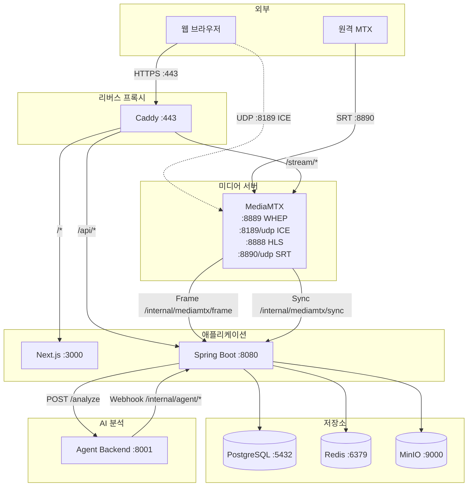
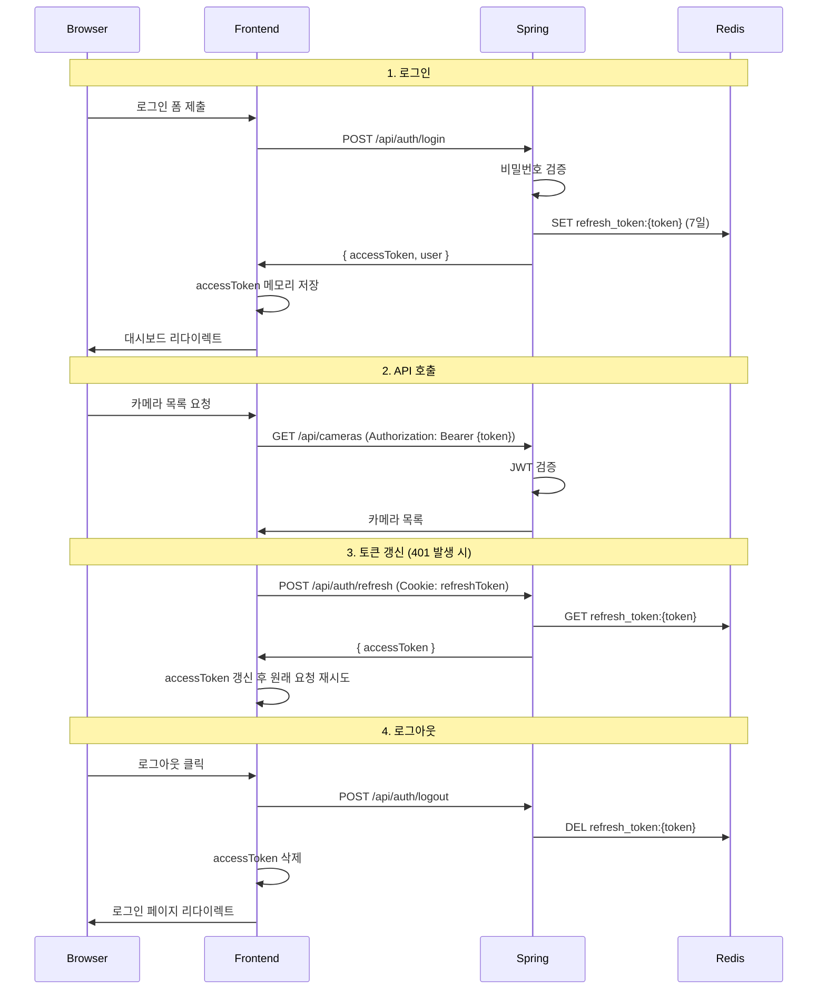
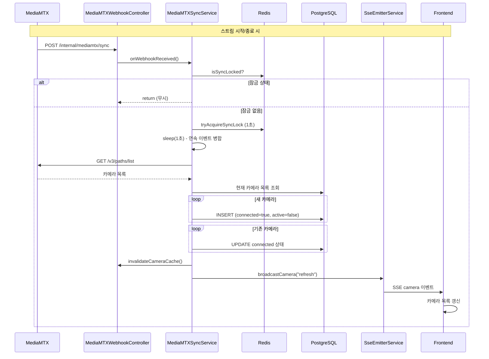
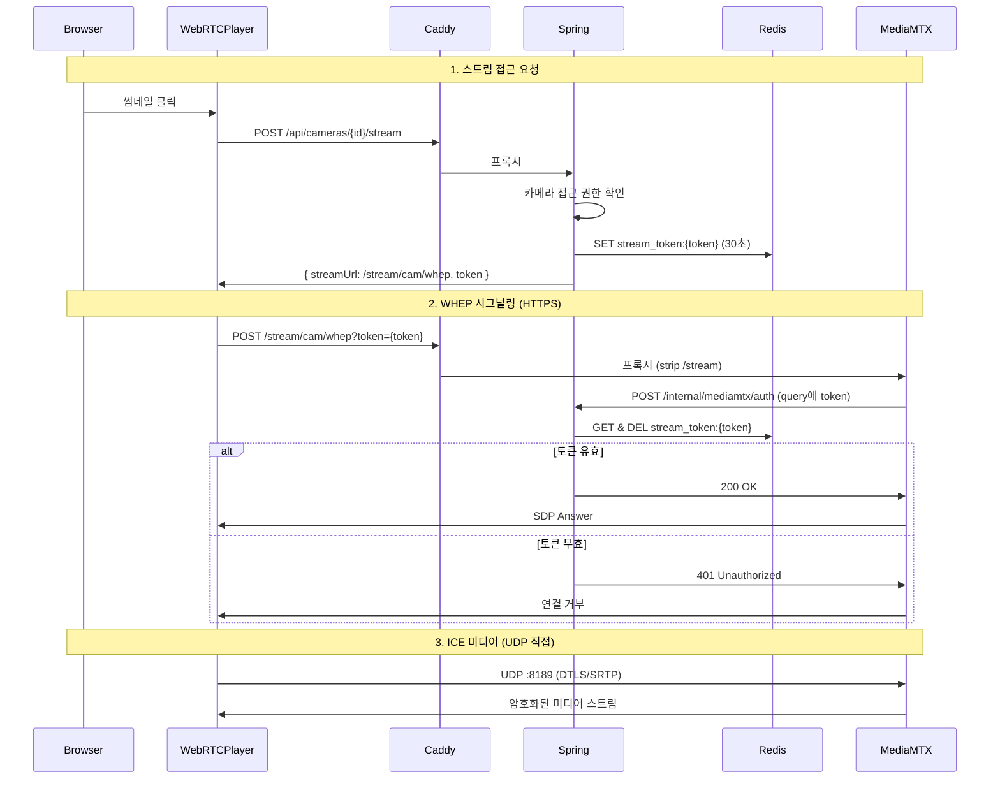
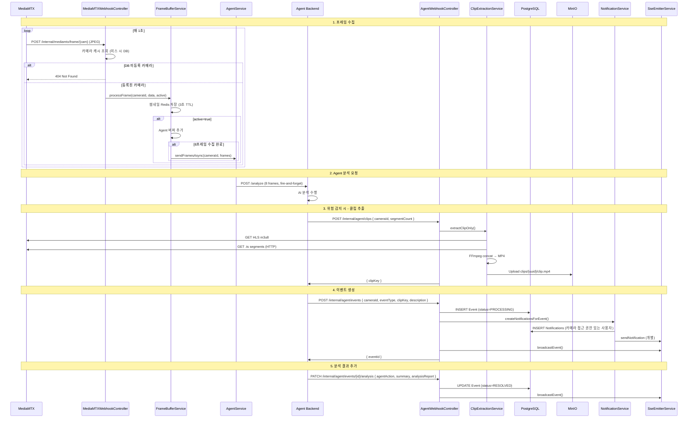
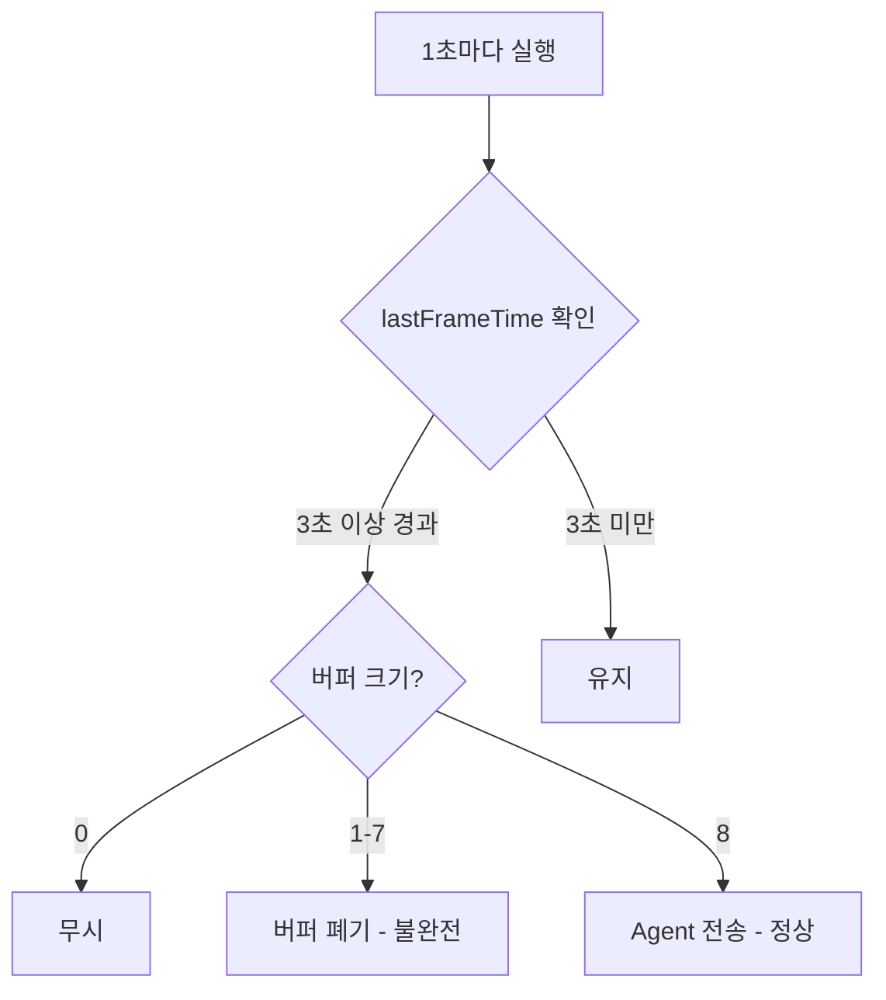
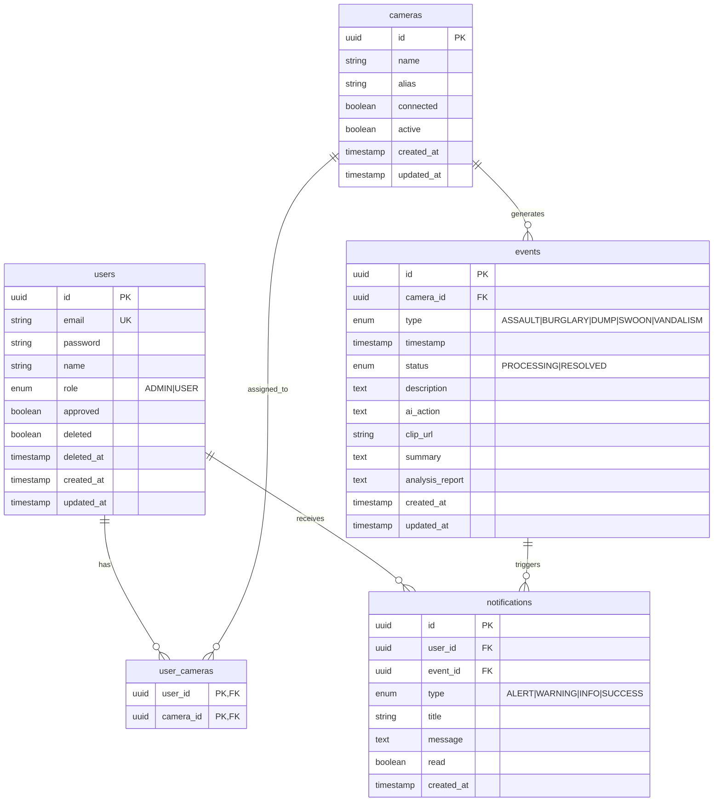

# AEGIS 프로젝트 워크플로우 문서

> Agent 기반 실시간 CCTV 안전 모니터링 시스템

**최종 업데이트**: 2026-01-23

---

## 목차

1. [프로젝트 개요](#1-프로젝트-개요)
2. [시스템 아키텍처](#2-시스템-아키텍처)
3. [인프라 구성](#3-인프라-구성)
4. [백엔드 구조](#4-백엔드-구조)
5. [프론트엔드 구조](#5-프론트엔드-구조)
6. [핵심 워크플로우](#6-핵심-워크플로우)
7. [API 명세](#7-api-명세)
8. [데이터 모델](#8-데이터-모델)
9. [개발 가이드](#9-개발-가이드)

---

## 1. 프로젝트 개요

### 1.1 시스템 목적

AEGIS(Agent 기반 안전 모니터링 시스템)는 CCTV 영상을 실시간으로 분석하여 위험 상황을 자동 감지하고 대응하는 시스템입니다.

**주요 기능:**
- 실시간 CCTV 영상 스트리밍 (WebRTC)
- AI 기반 위험 상황 감지 (폭행, 절도, 투기, 실신, 파손)
- 이벤트 발생 시 자동 클립 저장 및 알림
- 사용자별 카메라 접근 권한 관리

### 1.2 기술 스택

| 영역 | 기술 | 버전 |
|------|------|------|
| **Backend** | Spring Boot, Java, JPA, Spring Security | 3.5.9, 21 |
| **Frontend** | Next.js, React, TypeScript, TailwindCSS | 15.5, 19 |
| **Database** | PostgreSQL | 17 |
| **Cache** | Redis | 7 |
| **Storage** | MinIO (S3 호환) | Latest |
| **Media** | MediaMTX | Latest |
| **Proxy** | Caddy | 2 |
| **Package** | Gradle, pnpm | 8.x, 9.x |

### 1.3 디렉토리 구조

```
aegis/
├── aegis-backend/           # Spring Boot 백엔드
│   └── src/main/java/com/aegis/aegisbackend/
│       ├── domain/          # 도메인 레이어
│       │   ├── auth/        # 인증 (로그인, 회원가입, 토큰)
│       │   ├── camera/      # 카메라 관리
│       │   ├── event/       # 이벤트 (위험 감지 기록)
│       │   ├── notification/# 알림 및 SSE
│       │   ├── stats/       # 통계
│       │   ├── stream/      # 스트림 접근, 프레임 버퍼
│       │   └── user/        # 사용자 관리
│       ├── global/          # 전역 설정
│       │   ├── common/      # 공통 Enum, DTO
│       │   ├── config/      # Spring 설정
│       │   ├── exception/   # 예외 처리
│       │   └── security/    # JWT, 인증 필터
│       └── infra/           # 인프라 레이어
│           ├── agent/       # Agent 백엔드 연동
│           ├── mediamtx/    # MediaMTX 연동
│           ├── redis/       # Redis 토큰 서비스
│           └── s3/          # MinIO/S3 서비스
├── aegis-frontend/          # Next.js 프론트엔드
│   └── src/
│       ├── app/             # App Router 페이지
│       ├── components/      # React 컴포넌트
│       ├── contexts/        # React Context (Auth)
│       ├── hooks/           # Custom Hooks (SSE, Toast)
│       ├── lib/             # API 클라이언트, 유틸
│       └── types/           # TypeScript 타입
└── aegis-infra/             # Docker 인프라
    ├── docker-compose.yml
    ├── Caddyfile
    ├── mediamtx.yml
    └── Dockerfile.mediamtx
```

---

## 2. 시스템 아키텍처

### 2.1 전체 아키텍처 다이어그램



**연결 흐름:**
1. **브라우저 → Caddy**: HTTPS로 모든 요청 수신
2. **Caddy 라우팅**:
   - `/*` → Next.js 프론트엔드
   - `/api/*` → Spring Boot 백엔드
   - `/stream/*` → MediaMTX WebRTC WHEP (시그널링)
   - `/internal/*` → 403 차단 (외부 접근 불가)
3. **브라우저 ↔ MediaMTX**: WebRTC ICE (UDP 8189)는 직접 연결 (DTLS 암호화)
4. **원격 MTX → MediaMTX**: SRT (8890/udp)로 영상 스트림 수신
5. **MediaMTX → Backend**: 프레임 전송, 동기화 웹훅 (내부망)
6. **Backend → Agent**: AI 분석 요청 (fire-and-forget)
7. **Agent → Backend**: 분석 결과 웹훅 (클립 추출, 이벤트 생성)

### 2.2 네트워크 구성

| 경로 | 프로토콜 | 포트 | 설명 |
|------|----------|------|------|
| 브라우저 → Caddy | HTTPS | 443 | 모든 웹 요청 진입점 |
| 브라우저 ↔ MediaMTX | UDP (ICE) | 8189 | WebRTC 미디어 직접 연결 |
| 원격 MTX → MediaMTX | SRT | 8890/udp | 영상 스트림 수신 |
| Caddy → Frontend | HTTP | 3000 | 프론트엔드 프록시 (`/*`) |
| Caddy → Backend | HTTP | 8080 | API 프록시 (`/api/*`) |
| Caddy → MediaMTX | HTTP | 8889 | WebRTC WHEP 시그널링 (`/stream/*`) |
| MediaMTX → Backend | HTTP | 8080 | 프레임/동기화 웹훅 (`/internal/mediamtx/*`) |
| Backend → MediaMTX | HTTP | 9997 | 카메라 목록 조회 API |
| Backend → MediaMTX | HTTP | 8888 | HLS 세그먼트 다운로드 (클립 추출) |
| Backend → Agent | HTTP | 8001 | AI 분석 요청 |
| Agent → Backend | HTTP | 8080 | 분석 결과 웹훅 (`/internal/agent/*`) |
| Backend → PostgreSQL | TCP | 5432 | 데이터베이스 연결 |
| Backend → Redis | TCP | 6379 | 캐시/토큰 저장 |
| Backend → MinIO | HTTP | 9000 | S3 호환 스토리지 |

### 2.3 보안 경계

```
┌─────────────────────────────────────────────────────────────┐
│                      외부 접근 (Caddy)                       │
│  • /api/* → JWT 인증 필요 (Spring Security)                 │
│  • /* → 프론트엔드 (정적 파일)                               │
└─────────────────────────────────────────────────────────────┘
                              ↓
┌─────────────────────────────────────────────────────────────┐
│                    내부망 (Docker Network)                   │
│  • /internal/* → 인증 없음 (Caddy 미프록시)                  │
│  • MediaMTX, Agent, Redis, PostgreSQL, MinIO                │
└─────────────────────────────────────────────────────────────┘
```

**SecurityConfig 규칙:**
- `/api/auth/login`, `/api/auth/signup`, `/api/auth/refresh` → 인증 없이 허용
- `/internal/**` → 인증 없이 허용 (내부망 전용)
- `/api/users/**` → ADMIN 권한 필요
- 그 외 → 인증 필요

---

## 3. 인프라 구성

### 3.1 Docker Compose 서비스

| 서비스 | 이미지 | 포트 | 역할 |
|--------|--------|------|------|
| **caddy** | caddy:latest | 443 | HTTPS 리버스 프록시, 자동 TLS |
| **mediamtx** | custom | 8889, 8189/udp, 8888, 8890/udp, 9997 | 미디어 스트리밍 서버 |
| **postgres** | postgres:latest | 5432 | 메인 데이터베이스 |
| **redis** | redis:latest | 6379 | 세션, 토큰, 썸네일 캐시 |
| **minio** | minio/minio:latest | 9000, 9001 | 오브젝트 스토리지 (클립 저장) |
| **createbuckets** | minio/mc:latest | - | MinIO 버킷 자동 생성 (초기화 후 종료) |

### 3.2 Caddy 라우팅

```
localhost:443
├── /api/*       → host.docker.internal:8080 (Spring Boot)
├── /internal/*  → 403 차단 (외부 접근 불가)
├── /stream/*    → host.docker.internal:8889 (MediaMTX WHEP)
└── /*           → host.docker.internal:3000 (Next.js)
```

### 3.3 MediaMTX 설정

**프로토콜:**

| 프로토콜 | 포트 | 용도 |
|----------|------|------|
| SRT | 8890/udp | 원격 MTX에서 스트림 수신 |
| WebRTC WHEP | 8889 | 시그널링 (Caddy 프록시) |
| WebRTC ICE | 8189/udp | 미디어 (직접 연결, DTLS 암호화) |
| HLS | 8888 | 웹 브라우저 영상 재생, 클립 추출 |
| API | 9997 | 카메라 목록 조회 |

**WebRTC ICE 설정 (Docker 환경):**
- `webrtcICEHostNAT1To1IPs`: 브라우저에 알려줄 ICE 후보 IP (개발: 127.0.0.1, 프로덕션: 공개 IP)
- `webrtcICEUDPMuxAddress`: UDP 멀티플렉싱 주소 (:8189)

**HLS 녹화 설정:**
- `hlsSegmentCount`: 10 (유지할 세그먼트 수)
- `hlsSegmentDuration`: 3s (세그먼트 길이)
- `hlsDirectory`: /recordings (저장 경로)
- → 3초 × 10개 = 최근 30초 영상 보관

**스트림 이벤트 훅:**

| 이벤트 | 동작 |
|--------|------|
| `runOnReady` | 스트림 시작 시 동기화 트리거 + FFmpeg 1fps 프레임 추출 루프 |
| `runOnNotReady` | 스트림 종료 시 동기화 트리거 |

**인증:**
- 송출 인증: `authInternalUsers` (aegis/trillion)
- 시청 인증: `authHTTPAddress` → `POST /internal/mediamtx/auth`
  - `publish` 액션: 내부 인증 사용 (바로 OK)
  - `rtsp`, `hls` 프로토콜: 인증 없이 통과 (내부 사용)
  - `webrtc` read 요청: 토큰 검증 필요 (query parameter `?token=`)

**WebRTC 스트림 요구사항:**
- H264 인코딩 시 B-frame 비활성화 필수 (`-tune zerolatency` 또는 `-profile:v baseline`)
- WebRTC는 B-frame을 지원하지 않음

### 3.4 Redis 키 구조

| 키 패턴 | 값 | TTL | 용도 |
|---------|----|----|------|
| `refresh_token:{token}` | userId | 7일 | 리프레시 토큰 저장 |
| `stream_token:{token}` | userId:cameraId | 30초 | 스트림 접근 토큰 (일회용) |
| `mediamtx:sync:lock` | "locked" | 1초 | 동기화 중복 방지 잠금 |
| `thumbnail:{cameraId}` | base64 이미지 | 3초 | 썸네일 캐시 |

### 3.5 MinIO 버킷 구조

```
files/
└── clips/
    └── {clipId}/
        └── clip.mp4       # Agent 요청으로 생성, 이벤트에 clipUrl로 연결
```

**플로우:**
1. Agent가 클립 추출 요청 → `clips/{uuid}/clip.mp4` 저장
2. Agent가 이벤트 생성 시 clipKey 전달 → Event.clipUrl에 저장
3. 프론트엔드는 Spring API를 통해 클립 접근 (MinIO 직접 접근 안 함)
   - 다운로드: `GET /api/events/{id}/clip`
   - 스트리밍: `GET /api/events/{id}/clip/stream` (Range 요청 지원)

---

## 4. 백엔드 구조

### 4.1 레이어 아키텍처

```
┌─────────────────────────────────────────────────────────────┐
│                     Controller Layer                         │
│  • REST API 엔드포인트                                       │
│  • 요청 검증, 응답 변환                                      │
└─────────────────────────────────────────────────────────────┘
                              ↓
┌─────────────────────────────────────────────────────────────┐
│                      Service Layer                           │
│  • 비즈니스 로직                                             │
│  • 트랜잭션 관리                                             │
└─────────────────────────────────────────────────────────────┘
                              ↓
┌─────────────────────────────────────────────────────────────┐
│                    Repository Layer                          │
│  • JPA Repository                                            │
│  • 데이터 접근                                               │
└─────────────────────────────────────────────────────────────┘
```

### 4.2 도메인별 구성

#### 4.2.1 Auth 도메인

**역할:** 사용자 인증 및 토큰 관리

| 클래스 | 역할 |
|--------|------|
| `AuthController` | 로그인, 회원가입, 토큰 갱신, 로그아웃, 프로필 관리 |
| `AuthService` | 인증 로직, JWT 생성, Redis 토큰 저장 |
| `AuthDto` | LoginRequest, LoginResponse, SignupRequest, RefreshResponse, PasswordChangeRequest, ProfileUpdateRequest |

**인증 플로우:**
1. 로그인 → Access Token (응답) + Refresh Token (Redis + Cookie)
2. API 호출 → Authorization 헤더로 Access Token 전달
3. 토큰 만료 → Refresh Token으로 갱신
4. 로그아웃 → Redis에서 Refresh Token 삭제

#### 4.2.2 Camera 도메인

**역할:** 카메라 CRUD 및 썸네일 제공

| 클래스 | 역할 |
|--------|------|
| `CameraController` | 카메라 목록, 상세, 수정, 썸네일 |
| `CameraService` | 카메라 조회 (권한별), 수정 시 SSE 브로드캐스트 |
| `Camera` (Entity) | id, name, alias, connected, active |
| `UserCamera` (Entity) | User-Camera 다대다 매핑 (복합 키) |
| `CameraDto` | CameraDto, UpdateRequest |

**카메라 상태:**
- `connected`: MediaMTX 연결 여부 (자동 동기화)
- `active`: AI 분석 활성화 여부 (사용자 제어)

**권한:**
- ADMIN: 모든 카메라 접근
- USER: `user_cameras` 테이블에 매핑된 카메라만 접근

#### 4.2.3 Event 도메인

**역할:** AI 감지 이벤트 관리

| 클래스 | 역할 |
|--------|------|
| `EventController` | 이벤트 목록, 상세, 상태 변경, 클립 다운로드 |
| `EventService` | 이벤트 CRUD, 상태 변경 시 SSE 브로드캐스트 |
| `Event` (Entity) | id, camera, type, timestamp, status, description, clipUrl, agentAction, summary, analysisReport |
| `EventDto` | EventDto, CreateRequest, UpdateStatusRequest |

**이벤트 타입 (EventType):**
- `ASSAULT`: 폭행
- `BURGLARY`: 절도
- `DUMP`: 투기
- `SWOON`: 실신
- `VANDALISM`: 파손

**이벤트 상태 (EventStatus):**
- `PROCESSING`: Agent 분석 중
- `RESOLVED`: 분석 완료

#### 4.2.4 Notification 도메인

**역할:** 알림 관리 및 SSE 실시간 푸시

| 클래스 | 역할 |
|--------|------|
| `NotificationController` | 알림 목록, 읽음 처리, SSE 스트림 |
| `NotificationService` | 알림 생성, 이벤트 발생 시 관련 사용자에게 알림 |
| `SseEmitterService` | SSE 연결 관리, 브로드캐스트 |
| `Notification` (Entity) | id, user, event, type, title, message, read |
| `NotificationDto` | NotificationDto |

**알림 타입 (NotificationType):**
- `ALERT`: 긴급 알림 (폭행, 절도)
- `WARNING`: 경고 알림 (투기, 실신, 파손)
- `INFO`: 정보 알림
- `SUCCESS`: 성공 알림

**SSE 이벤트 타입:**

| 이벤트 | 범위 | 발생 시점 |
|--------|------|----------|
| `connect` | 개별 | SSE 연결 성공 |
| `notification` | 개별 | 알림 생성 (해당 사용자만) |
| `camera` | 전체 | 카메라 추가/삭제/상태 변경 |
| `event` | 전체 | 이벤트 생성/상태 변경 |
| `member` | 전체 | 멤버 승인/삭제/역할 변경 |

#### 4.2.5 Stats 도메인

**역할:** 대시보드 통계

| 클래스 | 역할 |
|--------|------|
| `StatsController` | 통계 조회 (일별, 유형별, 월별) |
| `StatsService` | 통계 계산 |
| `StatsDto` | DailyStats, EventTypeStats, MonthlyData |

**통계 타입:**
- `daily`: 최근 7일 일별 이벤트 수
- `event-types`: 이벤트 유형별 분포
- `monthly`: 월별 이벤트 캘린더 데이터

#### 4.2.6 Stream 도메인

**역할:** 스트림 접근 및 프레임 버퍼링

| 클래스 | 역할 |
|--------|------|
| `StreamService` | 스트림 토큰 발급, 인증 검증 |
| `FrameBufferService` | 썸네일 Redis 저장, Agent 버퍼 관리 |
| `StreamDto` | StreamAccessResponse, MediaMTXAuthRequest |

**프레임 처리 플로우:**
1. MediaMTX에서 1fps 프레임 전송
2. 썸네일: 모든 카메라 → Redis 저장 (3초 TTL)
3. Agent 버퍼: `active=true` 카메라만 → 메모리 버퍼에 8장 수집
4. 8장 수집 완료 → AgentService로 전송
5. 3초 타임아웃 시 버퍼 폐기 (8장 미만은 전송 안 함)

#### 4.2.7 User 도메인

**역할:** 사용자 관리 (Admin 전용)

| 클래스 | 역할 |
|--------|------|
| `UserController` | 사용자 목록, 상세, 수정, 삭제, 승인 |
| `UserService` | 사용자 CRUD, 승인 시 SSE 브로드캐스트 |
| `User` (Entity) | id, email, password, name, role, approved, deleted |
| `UserDto` | UserDto, UpdateRequest |

**사용자 역할 (UserRole):**
- `ADMIN`: 관리자 (모든 권한)
- `USER`: 일반 사용자 (할당된 카메라만)

**승인 플로우:**
1. 회원가입 → `approved=false`
2. Admin 승인 → `approved=true`
3. 미승인 사용자 로그인 시 → 403 Forbidden

### 4.3 인프라 레이어

#### 4.3.1 Agent 연동

| 클래스 | 역할 |
|--------|------|
| `AgentService` | Agent 백엔드에 프레임 전송 (fire-and-forget) |
| `AgentWebhookController` | Agent 백엔드에서 호출하는 웹훅 수신 |
| `AgentAnalysisRequest` | Agent 분석 요청 DTO (cameraId, frames) |
| `ClipRequest` | 클립 추출 요청 DTO (cameraId, segmentCount) |
| `CreateEventRequest` | 이벤트 생성 요청 DTO (cameraId, eventType, clipKey, description, timestamp) |
| `AnalysisResultRequest` | 분석 결과 DTO (agentAction, summary, analysisReport) |

**AgentService:**
- `sendFramesAsync()`: 8장 프레임을 Base64로 인코딩하여 Agent에 비동기 전송
- `isAgentServerHealthy()`: Agent 서버 상태 확인

**AgentWebhookController 엔드포인트:**

| 엔드포인트 | 메서드 | 역할 |
|------------|--------|------|
| `/internal/agent/clips` | POST | 클립 추출 요청 → clipKey 반환 |
| `/internal/agent/events` | POST | 이벤트 생성 → eventId 반환, 알림 생성, SSE |
| `/internal/agent/events/{id}/analysis` | PATCH | 분석 결과 추가, 상태 RESOLVED로 변경 |

#### 4.3.2 MediaMTX 연동

| 클래스 | 역할 |
|--------|------|
| `MediaMTXWebhookController` | MediaMTX 웹훅 수신 (동기화, 인증, 프레임) |
| `MediaMTXSyncService` | 카메라 목록 동기화 |
| `ClipExtractionService` | HLS 세그먼트에서 MP4 클립 추출 |

**MediaMTXWebhookController 엔드포인트:**

| 엔드포인트 | 메서드 | 역할 |
|------------|--------|------|
| `/internal/mediamtx/sync` | POST | 카메라 동기화 트리거 |
| `/internal/mediamtx/auth` | POST | 스트림 시청 인증 |
| `/internal/mediamtx/frame/{cameraName}` | POST | 프레임 수신 |

**동기화 로직:**
1. 웹훅 수신 → Redis 1초 잠금 확인
2. 잠금 획득 성공 → 1초 대기 (연속 이벤트 병합)
3. MediaMTX API에서 전체 카메라 목록 조회
4. DB 동기화:
   - 새 카메라: `connected=true, active=false`로 추가
   - 기존 카메라: `connected` 상태 업데이트
5. 변경 시 캐시 무효화 + SSE `camera` 브로드캐스트

**프레임 수신 로직:**
1. 카메라 이름으로 로컬 캐시 조회 (캐시 미스 시 DB 조회)
2. DB 미등록 카메라 → 404 반환 (거부)
3. 썸네일 Redis 저장 (모든 카메라)
4. Agent 버퍼 추가 (`active=true` 카메라만)

**클립 추출 로직:**
1. MediaMTX HLS API에서 m3u8 플레이리스트 파싱
2. 최신 N개 .ts 세그먼트 HTTP 다운로드
3. FFmpeg concat으로 MP4 변환
4. MinIO에 업로드

#### 4.3.3 Redis 서비스

| 클래스 | 역할 |
|--------|------|
| `RedisTokenService` | 토큰 저장/조회/삭제, 동기화 잠금 |

**주요 메서드:**
- `saveRefreshToken()`, `getUserIdByRefreshToken()`, `deleteRefreshToken()`
- `generateStreamToken()`, `validateAndConsumeStreamToken()`, `isStreamTokenValid()`
- `tryAcquireSyncLock()`, `isSyncLocked()`

#### 4.3.4 S3 서비스

| 클래스 | 역할 |
|--------|------|
| `S3Service` | MinIO/S3 파일 업로드/다운로드/삭제 |

**주요 메서드:**
- `uploadEventClip()`: 이벤트 클립 업로드 (UUID 기반 키 생성)
- `uploadClip()`: 클립 업로드 (키 직접 지정)
- `downloadClip()`: 클립 다운로드 (키 직접 지정)
- `deleteEventClip()`: 이벤트 클립 삭제
- `clipExists()`: 클립 존재 여부 확인

### 4.4 전역 설정

#### 4.4.1 Security 설정

| 클래스 | 역할 |
|--------|------|
| `SecurityConfig` | Spring Security 설정 |
| `JwtAuthenticationFilter` | JWT 검증 필터 |
| `JwtTokenProvider` | JWT 생성/검증 |
| `CustomUserDetailsService` | 사용자 조회 |

#### 4.4.2 예외 처리

| 클래스 | 역할 |
|--------|------|
| `GlobalExceptionHandler` | 전역 예외 핸들러 |
| `BusinessException` | 비즈니스 예외 |
| `ErrorCode` | 에러 코드 정의 |

**주요 에러 코드:**

| 코드 | HTTP 상태 | 설명 |
|------|----------|------|
| `EMAIL_NOT_FOUND` | 401 | 등록되지 않은 이메일 |
| `INVALID_PASSWORD` | 401 | 비밀번호 불일치 |
| `USER_NOT_APPROVED` | 403 | 관리자 승인 대기 중 |
| `CAMERA_NOT_FOUND` | 404 | 카메라 없음 |
| `CAMERA_ACCESS_DENIED` | 403 | 카메라 접근 권한 없음 |
| `EVENT_NOT_FOUND` | 404 | 이벤트 없음 |
| `CLIP_EXTRACTION_FAILED` | 500 | 클립 추출 실패 |

#### 4.4.3 기타 설정

| 클래스 | 역할 |
|--------|------|
| `AsyncConfig` | @Async 스레드 풀 설정 |
| `RedisConfig` | Redis 연결 설정 |
| `S3Config` | MinIO/S3 클라이언트 설정 |
| `DataInitializer` | 초기 Admin 계정 생성 |

---

## 5. 프론트엔드 구조

### 5.1 페이지 구조

| 경로 | 파일 | 설명 | 권한 |
|------|------|------|------|
| `/` | `page.tsx` | 메인 대시보드 (CCTV 그리드, 이벤트 로그) | 인증 |
| `/auth` | `auth/page.tsx` | 로그인/회원가입 | 미인증 |
| `/events` | `events/page.tsx` | 이벤트 목록 및 상세 | 인증 |
| `/members` | `members/page.tsx` | 멤버 관리 | Admin |
| `/settings` | `settings/page.tsx` | 설정 (프로필, 비밀번호) | 인증 |
| `/statistics` | `statistics/page.tsx` | 통계 대시보드 | 인증 |

### 5.2 컴포넌트 구조

```
components/
├── NavLink.tsx              # 네비게이션 링크 컴포넌트
├── layout/
│   ├── DashboardLayout.tsx  # 대시보드 레이아웃 (사이드바 + 헤더)
│   ├── Header.tsx           # 헤더 (알림, 프로필)
│   └── ProtectedRoute.tsx   # 인증 보호 라우트
├── dashboard/
│   ├── DashboardContent.tsx # 대시보드 메인
│   ├── CCTVGrid.tsx         # 카메라 그리드
│   ├── CameraThumbnail.tsx  # 썸네일 (클릭 시 스트림)
│   ├── CameraDetailModal.tsx # 카메라 상세 모달
│   ├── WebRTCPlayer.tsx     # WebRTC 플레이어
│   ├── EventLog.tsx         # 실시간 이벤트 로그
│   ├── EventDetailModal.tsx # 이벤트 상세 모달
│   └── StatsDashboard.tsx   # 대시보드 통계
├── events/
│   └── EventsPageContent.tsx # 이벤트 페이지 컨텐츠
├── members/
│   └── MembersPageContent.tsx # 멤버 페이지 컨텐츠
├── notifications/
│   └── NotificationModal.tsx # 알림 모달
├── statistics/
│   └── StatisticsPageContent.tsx # 통계 페이지 컨텐츠
├── settings/
│   └── SettingsPageContent.tsx # 설정 페이지 컨텐츠 (프로필, 비밀번호)
├── auth/
│   └── AuthForm.tsx         # 로그인/회원가입 폼
└── ui/                      # shadcn/ui 컴포넌트
```

### 5.3 상태 관리

#### 5.3.1 AuthContext

**역할:** 전역 인증 상태 관리

**상태:**
- `user`: 현재 로그인 사용자 정보 (User | null)
- `isLoading`: 로딩 상태
- `isAdmin`: 관리자 여부 (user?.role === 'admin')

**메서드:**
- `login(email, password)`: 로그인
- `signup(email, password, name)`: 회원가입
- `logout()`: 로그아웃

#### 5.3.2 React Query

**역할:** 서버 상태 캐싱 및 동기화

**Query Keys (queryKeys.ts):**
- `['streams']`: 카메라(스트림) 목록
- `['streams', id]`: 카메라 상세
- `['eventLogs']`: 이벤트 목록
- `['eventLogs', id]`: 이벤트 상세
- `['eventLogs', filter]`: 필터링된 이벤트
- `['stats']`: 전체 통계
- `['stats', 'daily']`: 일별 통계
- `['stats', 'monthly']`: 월별 통계
- `['stats', 'summary']`: 요약 통계

### 5.4 Custom Hooks

#### 5.4.1 useNotificationStream

**역할:** SSE 연결 및 실시간 이벤트 수신

**기능:**
- 로그인 시 자동 SSE 연결
- 알림 수신 시 토스트 표시
- 카메라/이벤트/멤버 업데이트 콜백
- 연결 끊김 시 자동 재연결

**사용:**
```typescript
useNotificationStream(
  onNotification,   // 알림 수신 콜백
  onCameraUpdate,   // 카메라 업데이트 콜백
  onEventUpdate,    // 이벤트 업데이트 콜백
  onMemberUpdate    // 멤버 업데이트 콜백
);
```

#### 5.4.2 useMonitoring

**역할:** 카메라 및 이벤트 데이터 조회 (React Query 래퍼)

**훅:**
- `useStreams()`: 카메라 목록 조회
- `useEventLogs()`: 이벤트 목록 조회

#### 5.4.3 use-toast

**역할:** 토스트 알림 표시

#### 5.4.4 use-mobile

**역할:** 모바일 뷰포트 감지

### 5.5 API 클라이언트

#### 5.5.1 axios.ts

**역할:** Axios 인스턴스 및 인터셉터

**기능:**
- 상대경로 사용 (Caddy가 /api를 백엔드로 라우팅)
- 요청 인터셉터: Authorization 헤더 추가
- 응답 인터셉터: 401 시 토큰 갱신 시도, 실패 시 /auth로 리다이렉트
- `withCredentials: true` (쿠키 전송)
- Access Token 메모리 저장 (`setAccessToken`, `getAccessToken`)

#### 5.5.2 api.ts

**역할:** API 함수 모음

| 객체 | 메서드 |
|------|--------|
| `authApi` | login, signup, logout, refresh, me, changePassword, updateProfile, deleteAccount |
| `camerasApi` | getAll, getById, update, requestStream, getThumbnail, getThumbnailUrl |
| `eventsApi` | getAll, getById, updateStatus, getClipDownloadUrl, getClipStreamUrl, getClipUrl (deprecated) |
| `notificationsApi` | getAll, getUnreadCount, markAsRead, markAllAsRead, delete |
| `statsApi` | getDaily, getEventTypes, getMonthly |
| `usersApi` | getAll, getById, update, delete, approve |

### 5.6 TypeScript 타입

```typescript
// 카메라
interface Camera { id, name, connected }
interface ManagedCamera extends Camera { alias, active }
interface CameraUpdateRequest { alias?, active? }

// 이벤트
interface Event {
  id, cameraId, cameraName,
  type: 'assault' | 'burglary' | 'dump' | 'swoon' | 'vandalism',
  timestamp, status: 'processing' | 'resolved',
  description, agentAction?, clipUrl?, summary?, analysisReport?
}
interface EventUpdateStatusRequest { status: 'processing' | 'resolved' }

// 알림
interface Notification {
  id, type: 'alert' | 'warning' | 'info' | 'success',
  title, message, timestamp, read, eventId?
}

// 사용자
interface User {
  id, email, name, role: 'user' | 'admin',
  assignedCameras, createdAt, approved
}
interface UserUpdateRequest { name?, role?, assignedCameras? }

// 인증
interface LoginRequest { email, password }
interface LoginResponse { accessToken, user }
interface SignupRequest { email, password, name }
interface RefreshResponse { accessToken }
interface PasswordChangeRequest { currentPassword, newPassword }

// 스트림
interface StreamAccessResponse { streamUrl, token, cameraId, cameraName }
interface ThumbnailResponse { image: string }  // Base64

// 통계
interface DailyStat { day, events, resolved }
interface EventTypeStat { type, count, color }
interface MonthlyEventData { [date]: { events, alerts } }
```

---

## 6. 핵심 워크플로우

### 6.1 사용자 인증 플로우



### 6.2 카메라 동기화 플로우



### 6.3 실시간 스트리밍 플로우



### 6.4 AI 분석 및 이벤트 생성 플로우



### 6.5 프레임 버퍼 타임아웃 처리



**규칙:**
- 3초 이상 프레임이 안 들어오면 타임아웃
- 8장 미만 버퍼는 전송하지 않고 폐기
- 정확히 8장이면 Agent에 전송 후 폐기

---

## 7. API 명세

### 7.1 프론트엔드 API (`/api/*`)

#### Auth

| 엔드포인트 | 메서드 | 설명 | 인증 |
|------------|--------|------|------|
| `/api/auth/login` | POST | 로그인 | × |
| `/api/auth/signup` | POST | 회원가입 | × |
| `/api/auth/logout` | POST | 로그아웃 | ○ |
| `/api/auth/refresh` | POST | 토큰 갱신 | × |
| `/api/auth/me` | GET | 내 정보 | ○ |
| `/api/auth/me` | PATCH | 프로필 수정 | ○ |
| `/api/auth/me` | DELETE | 회원탈퇴 | ○ |
| `/api/auth/password` | PATCH | 비밀번호 변경 | ○ |

#### Cameras

| 엔드포인트 | 메서드 | 설명 | 인증 |
|------------|--------|------|------|
| `/api/cameras` | GET | 카메라 목록 | ○ |
| `/api/cameras/{id}` | GET | 카메라 상세 | ○ |
| `/api/cameras/{id}` | PATCH | 카메라 수정 (alias, active) | ○ |
| `/api/cameras/{id}/stream` | POST | 스트림 토큰 발급 | ○ |
| `/api/cameras/{id}/thumbnail` | GET | 썸네일 (JSON, base64) | ○ |
| `/api/cameras/{id}/thumbnail.jpg` | GET | 썸네일 (JPEG 바이너리) | ○ |

#### Events

| 엔드포인트 | 메서드 | 설명 | 인증 |
|------------|--------|------|------|
| `/api/events` | GET | 이벤트 목록 | ○ |
| `/api/events` | POST | 이벤트 생성 | ○ |
| `/api/events/{id}` | GET | 이벤트 상세 | ○ |
| `/api/events/{id}/status` | PATCH | 상태 변경 | ○ |
| `/api/events/{id}/clip` | GET | 클립 다운로드 (attachment) | ○ |
| `/api/events/{id}/clip/stream` | GET | 클립 스트리밍 재생 (Range 지원) | ○ |

#### Notifications

| 엔드포인트 | 메서드 | 설명 | 인증 |
|------------|--------|------|------|
| `/api/notifications` | GET | 알림 목록 | ○ |
| `/api/notifications/stream` | GET (SSE) | 실시간 스트림 | ○ |
| `/api/notifications/unread-count` | GET | 읽지 않은 수 | ○ |
| `/api/notifications/{id}/read` | PATCH | 읽음 처리 | ○ |
| `/api/notifications/read-all` | POST | 전체 읽음 | ○ |
| `/api/notifications/{id}` | DELETE | 삭제 | ○ |

#### Stats

| 엔드포인트 | 메서드 | 설명 | 인증 |
|------------|--------|------|------|
| `/api/stats?type=daily` | GET | 일별 통계 (7일) | ○ |
| `/api/stats?type=event-types` | GET | 유형별 통계 | ○ |
| `/api/stats?type=monthly` | GET | 월별 통계 | ○ |

#### Users (Admin)

| 엔드포인트 | 메서드 | 설명 | 인증 |
|------------|--------|------|------|
| `/api/users` | GET | 사용자 목록 | Admin |
| `/api/users/{id}` | GET | 사용자 상세 | Admin |
| `/api/users/{id}` | PATCH | 사용자 수정 | Admin |
| `/api/users/{id}` | DELETE | 사용자 삭제 | Admin |
| `/api/users/{id}/approve` | PATCH | 사용자 승인 | Admin |

### 7.2 내부망 API (`/internal/*`)

> Caddy 프록시를 통하지 않음 → 외부 접근 불가

#### MediaMTX 웹훅

| 엔드포인트 | 메서드 | 호출자 | 설명 |
|------------|--------|--------|------|
| `/internal/mediamtx/sync` | POST | MediaMTX | 카메라 동기화 트리거 |
| `/internal/mediamtx/auth` | POST | MediaMTX | 스트림 시청 인증 |
| `/internal/mediamtx/frame/{cameraName}` | POST | MediaMTX | 프레임 수신 (JPEG) |

#### Agent 웹훅

| 엔드포인트 | 메서드 | 호출자 | 설명 |
|------------|--------|--------|------|
| `/internal/agent/clips` | POST | Agent | 클립 추출 요청 |
| `/internal/agent/events` | POST | Agent | 이벤트 생성 |
| `/internal/agent/events/{id}/analysis` | PATCH | Agent | 분석 결과 추가 |

### 7.3 SSE 이벤트

**엔드포인트:** `GET /api/notifications/stream`  
**헤더:** `Authorization: Bearer {accessToken}`

| 이벤트 | 데이터 | 설명 |
|--------|--------|------|
| `connect` | "SSE 연결 성공" | 연결 확인 |
| `notification` | NotificationDto (JSON) | 새 알림 (해당 사용자만) |
| `camera` | CameraDto 또는 "refresh" | 카메라 변경 (전체) |
| `event` | EventDto (JSON) | 이벤트 변경 (전체) |
| `member` | UserDto (JSON) | 멤버 변경 (전체) |

---

## 8. 데이터 모델

### 8.1 ERD



### 8.2 인덱스

| 테이블 | 인덱스 | 컬럼 |
|--------|--------|------|
| users | idx_users_email | email |
| users | idx_users_approved | approved |
| cameras | idx_cameras_connected | connected |
| cameras | idx_cameras_active | active |
| events | idx_events_camera_id | camera_id |
| events | idx_events_type | type |
| events | idx_events_status | status |
| events | idx_events_timestamp | timestamp |
| notifications | idx_notifications_user_id | user_id |
| notifications | idx_notifications_user_read | user_id, read |
| notifications | idx_notifications_created_at | createdAt |

---

## 9. 개발 가이드

### 9.1 개발 환경 설정

```bash
# 1. 인프라 실행
cd aegis-infra
docker-compose up -d

# 2. 백엔드 실행
cd aegis-backend
./gradlew bootRun

# 3. 프론트엔드 실행
cd aegis-frontend
pnpm install
pnpm dev

# 4. 접속
# - https://localhost (Caddy 프록시)
# - http://localhost:3000 (Next.js 직접)
# - http://localhost:8080 (Spring Boot 직접)
```

### 9.2 환경 변수

**백엔드 (application.properties)**

```properties
# Database
spring.datasource.url=jdbc:postgresql://localhost:5432/aegis
spring.datasource.username=aegis
spring.datasource.password=trillion

# Redis
spring.data.redis.host=localhost
spring.data.redis.port=6379
spring.data.redis.password=

# MinIO (S3 Compatible)
aws.s3.access-key=aegis
aws.s3.secret-key=trillion
aws.s3.region=us-east-1
aws.s3.bucket=files
aws.s3.endpoint=http://localhost:9000

# JWT
jwt.secret=your-secret-key-must-be-at-least-256-bits-long-for-hs256
jwt.access-expiration=900000      # 15분 (밀리초)
jwt.refresh-expiration=604800000  # 7일 (밀리초)

# MediaMTX
mediamtx.api-url=http://localhost:9997
mediamtx.webrtc-url=/stream
mediamtx.hls-url=http://localhost:8888
mediamtx.recordings-dir=/recordings

# Clip Extraction
clip.extraction.temp-dir=/tmp/aegis-clips
clip.extraction.segment-count=10

# Admin Initialization
admin.email=admin@aegis.local
admin.password=changeyourpassword
admin.name=Admin

# Agent Backend (Python)
agent.api-url=http://localhost:8001
agent.enabled=false
agent.timeout-seconds=30
```

### 9.3 초기 데이터

- 첫 실행 시 `DataInitializer`가 Admin 계정 생성:
  - Email: `admin@aegis.local` (환경변수: `admin.email`)
  - Password: `changeyourpassword` (환경변수: `admin.password`)
  - Name: `Admin` (환경변수: `admin.name`)
  - Role: `ADMIN`
  - Approved: `true`

### 9.4 개발 시 주의사항

1. **카메라 동기화**: aegis-infra 실행 중이어야 함
2. **SSE 연결**: Access Token 필요 (로그인 상태)
3. **스트림 토큰**: 30초 TTL, 일회용 (사용 후 삭제)
4. **Agent 버퍼**: `active=false` 카메라는 AI 분석 제외
5. **프레임 수신**: DB 미등록 카메라는 404 반환
6. **클립 추출**: HLS 녹화가 활성화되어 있어야 함

### 9.5 테스트 시나리오

#### 카메라 추가 테스트
1. 원격 MTX에서 SRT로 스트림 송출
2. MediaMTX `runOnReady` → `/internal/mediamtx/sync` 호출
3. DB에 `connected=true, active=false`로 추가 확인
4. SSE `camera` 이벤트 수신 확인

#### AI 분석 테스트 (Agent 활성화 필요)
1. 카메라 `active=true` 설정
2. 8초간 프레임 수집 확인
3. Agent 백엔드로 프레임 전송 확인
4. Agent 웹훅으로 이벤트 생성 확인

---

## 10. 향후 개선 사항

| 항목 | 설명 | 우선순위 |
|------|------|----------|
| Agent 백엔드 구현 | Python 기반 영상 분석 | 높음 |
| PWA 지원 | 모바일 앱 설치 | 중간 |
| 다중 인스턴스 | Redis Pub/Sub SSE | 중간 |
| 알림 필터링 | 이벤트 타입별 알림 설정 | 낮음 |
