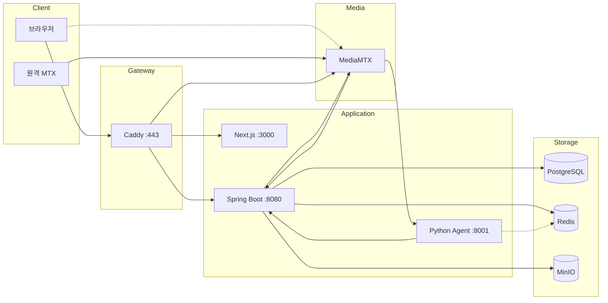
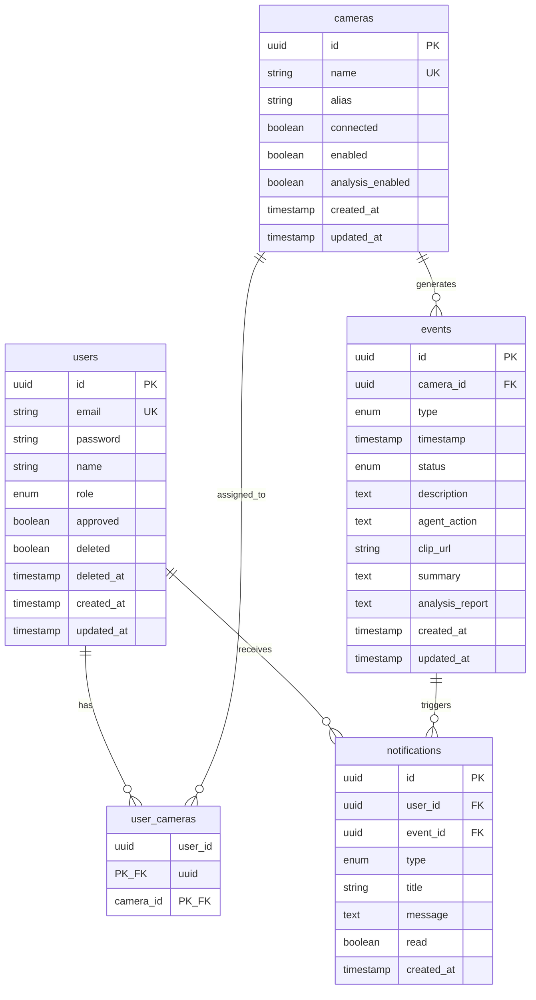

# AEGIS 워크플로우 문서

> CCTV 실시간 AI 안전 모니터링 시스템

**최종 업데이트**: 2026-01-23

---

## 1. 시스템 아키텍처

### 1.1 전체 구성

### 1.2 서비스 포트

| 서비스 | 포트 | 설명 |
|--------|------|------|
| Caddy | 443 | HTTPS 리버스 프록시 |
| Next.js | 3000 | 프론트엔드 |
| Spring Boot | 8080 | 백엔드 API |
| Python Agent | 8001 | AI 분석 |
| MediaMTX API | 9997 | 카메라 목록 조회 |
| MediaMTX WebRTC | 8889 | WHEP 시그널링 |
| MediaMTX ICE | 8189/udp | WebRTC 미디어 |
| MediaMTX HLS | 8888 | HLS 스트리밍 |
| MediaMTX SRT | 8890/udp | 스트림 수신 |
| PostgreSQL | 5432 | 데이터베이스 |
| Redis | 6379 | 캐시/토큰/Pub-Sub |
| MinIO | 9000 | 클립 스토리지 |

### 1.3 Caddy 라우팅

| 경로 | 대상 |
|------|------|
| `/api/*` | Spring Boot :8080 |
| `/stream/*` | MediaMTX :8889 (prefix strip) |
| `/*` | Next.js :3000 |

### 1.4 연결 흐름

**브라우저 → 백엔드:**
1. 브라우저 → Caddy (HTTPS :443)
2. Caddy → Next.js (`/*`) 또는 Spring Boot (`/api/*`)

**WebRTC 스트리밍:**
1. 브라우저 → Spring Boot: `POST /api/cameras/{id}/stream` → 토큰 발급
2. 브라우저 → Caddy → MediaMTX: `POST /stream/{cam}/whep?token=xxx`
3. MediaMTX → Spring Boot: `POST /internal/mediamtx/auth` → 토큰 검증
4. 브라우저 ↔ MediaMTX: UDP ICE 직접 연결 (DTLS 암호화)

**카메라 동기화:**
1. 원격 MTX → MediaMTX: SRT 스트림 송출
2. MediaMTX: `runOnReady` 훅 실행
3. MediaMTX → Spring Boot: `POST /internal/mediamtx/sync`
4. Spring Boot → MediaMTX: `GET /v3/paths/list`
5. Spring Boot → PostgreSQL: 카메라 INSERT/UPDATE
6. Spring Boot → 브라우저: SSE `camera` 이벤트
7. Spring Boot → Redis: Pub/Sub `camera:analysis:update`

**AI 분석:**
1. MediaMTX → Python Agent: `POST /frame/{cameraName}` (1fps JPEG)
2. Agent: Redis `camera:analysis:update` 채널 구독
3. Agent → Spring Boot: `GET /internal/agent/cameras/analysis`
4. Agent: 분석 대상 카메라 프레임 버퍼링 (8장)
5. Agent: AI 분석 수행
6. Agent → Spring Boot: `POST /internal/agent/clips` → clipKey
7. Agent → Spring Boot: `POST /internal/agent/events` → eventId
8. Agent → Spring Boot: `PATCH /internal/agent/events/{id}/analysis`

---

## 2. 데이터 모델

### 2.1 ERD

### 2.2 Enum 값

**UserRole:** `ADMIN`, `USER`

**EventType:** `ASSAULT`(폭행), `BURGLARY`(절도), `DUMP`(투기), `SWOON`(실신), `VANDALISM`(파손)

**EventStatus:** `PROCESSING`, `RESOLVED`

**NotificationType:** `ALERT`, `WARNING`, `INFO`, `SUCCESS`

### 2.3 Redis 키

| 키 패턴 | 값 | TTL |
|---------|----|----|
| `refresh_token:{token}` | userId | 7일 |
| `stream_token:{token}` | userId:cameraId | 30초 |
| `mediamtx:sync:lock` | "locked" | 1초 |

**Pub/Sub 채널:**
| 채널 | 메시지 | 구독자 |
|------|--------|--------|
| `camera:analysis:update` | "update" | Python Agent |

---

## 3. API 명세

### 3.1 Auth API

#### POST /api/auth/login
로그인

**Request:**
| 필드 | 타입 | 필수 | 설명 |
|------|------|------|------|
| email | string | O | 이메일 |
| password | string | O | 비밀번호 |

**Response:** `200 OK`
| 필드 | 타입 | 설명 |
|------|------|------|
| accessToken | string | JWT 액세스 토큰 |
| user | User | 사용자 정보 |

**Cookie:** `refreshToken` (HttpOnly, Secure, 7일)

**에러:**
- `401`: 이메일 없음 / 비밀번호 불일치
- `403`: 미승인 사용자

---

#### POST /api/auth/signup
회원가입

**Request:**
| 필드 | 타입 | 필수 | 설명 |
|------|------|------|------|
| email | string | O | 이메일 |
| password | string | O | 비밀번호 |
| name | string | O | 이름 |

**Response:** `200 OK`
| 필드 | 타입 | 설명 |
|------|------|------|
| success | boolean | 성공 여부 |
| message | string | "회원가입이 완료되었습니다. 관리자 승인 후 로그인이 가능합니다." |

**에러:**
- `409`: 이메일 중복

---

#### POST /api/auth/logout
로그아웃 (인증 필요)

**Response:** `200 OK`
| 필드 | 타입 | 설명 |
|------|------|------|
| success | boolean | true |

---

#### POST /api/auth/refresh
토큰 갱신

**Cookie:** `refreshToken` 필요

**Response:** `200 OK`
| 필드 | 타입 | 설명 |
|------|------|------|
| accessToken | string | 새 JWT 액세스 토큰 |

**에러:**
- `401`: 유효하지 않은 리프레시 토큰

---

#### GET /api/auth/me
내 정보 조회 (인증 필요)

**Response:** `200 OK` → User

---

#### PATCH /api/auth/me
프로필 수정 (인증 필요)

**Request:**
| 필드 | 타입 | 필수 | 설명 |
|------|------|------|------|
| name | string | O | 새 이름 |

**Response:** `200 OK` → User

---

#### DELETE /api/auth/me
회원탈퇴 (인증 필요, 소프트 삭제)

**Response:** `200 OK`
| 필드 | 타입 | 설명 |
|------|------|------|
| success | boolean | true |
| message | string | "회원탈퇴가 완료되었습니다." |

---

#### PATCH /api/auth/password
비밀번호 변경 (인증 필요)

**Request:**
| 필드 | 타입 | 필수 | 설명 |
|------|------|------|------|
| currentPassword | string | O | 현재 비밀번호 |
| newPassword | string | O | 새 비밀번호 |

**Response:** `200 OK`
| 필드 | 타입 | 설명 |
|------|------|------|
| success | boolean | true |
| message | string | "비밀번호가 변경되었습니다." |

**에러:**
- `401`: 현재 비밀번호 불일치

---

### 3.2 Camera API

#### GET /api/cameras
카메라 목록 조회 (인증 필요)

**정렬:** connected DESC → enabled DESC → alias ASC

**권한:** ADMIN은 전체, USER는 할당된 카메라만

**Response:** `200 OK` → Camera[]

---

#### GET /api/cameras/{id}
카메라 상세 조회 (인증 필요)

**Response:** `200 OK` → Camera

**에러:**
- `404`: 카메라 없음

---

#### PATCH /api/cameras/{id}
카메라 수정 (인증 필요)

**Request:**
| 필드 | 타입 | 필수 | 설명 |
|------|------|------|------|
| alias | string | X | 별칭 |
| enabled | boolean | X | 활성화 (false시 analysisEnabled도 false) |
| analysisEnabled | boolean | X | AI 분석 활성화 (enabled=true일 때만) |

**Response:** `200 OK` → Camera

**Side Effect:**
- enabled/analysisEnabled 변경 시 → Redis Pub/Sub 발행
- SSE `camera` 이벤트 브로드캐스트

---

#### POST /api/cameras/{id}/stream
스트림 토큰 발급 (인증 필요)

**Response:** `200 OK`
| 필드 | 타입 | 설명 |
|------|------|------|
| streamUrl | string | WebRTC WHEP URL (/stream/{cam}/whep) |
| token | string | 일회용 토큰 (30초) |
| cameraId | string | 카메라 ID |
| cameraName | string | 카메라 별칭 |

**에러:**
- `403`: 접근 권한 없음
- `404`: 카메라 없음
- `409`: 카메라 오프라인

---

### 3.3 Event API

#### GET /api/events
이벤트 목록 조회 (인증 필요)

**Response:** `200 OK` → Event[]

---

#### GET /api/events/{id}
이벤트 상세 조회 (인증 필요)

**Response:** `200 OK` → Event

---

#### POST /api/events
이벤트 생성 (인증 필요)

**Request:**
| 필드 | 타입 | 필수 | 설명 |
|------|------|------|------|
| cameraId | string | O | 카메라 ID |
| type | string | O | 이벤트 타입 |
| timestamp | string | X | ISO8601 (기본: 현재) |
| description | string | X | 설명 |
| agentAction | string | X | 권장 조치 |
| summary | string | X | 요약 |
| analysisReport | string | X | 분석 리포트 |
| clipData | byte[] | X | 클립 데이터 |

**Response:** `200 OK` → Event

---

#### PATCH /api/events/{id}/status
이벤트 상태 변경 (인증 필요)

**Request:**
| 필드 | 타입 | 필수 | 설명 |
|------|------|------|------|
| status | string | O | "processing" 또는 "resolved" |

**Response:** `200 OK` → Event

---

#### GET /api/events/{id}/clip
클립 다운로드 (인증 필요)

**Response:** `200 OK`
- Content-Type: video/mp4
- Content-Disposition: attachment

---

#### GET /api/events/{id}/clip/stream
클립 스트리밍 (인증 필요, Range 지원)

**Request Header:**
| 헤더 | 설명 |
|------|------|
| Range | bytes=start-end (선택) |

**Response:** `200 OK` 또는 `206 Partial Content`
- Content-Type: video/mp4
- Accept-Ranges: bytes

---

### 3.4 Notification API

#### GET /api/notifications
알림 목록 조회 (인증 필요)

**Response:** `200 OK` → Notification[]

---

#### GET /api/notifications/stream
SSE 스트림 연결 (인증 필요)

**Response:** `200 OK` (text/event-stream)

**이벤트:**
| 이벤트 | 데이터 | 설명 |
|--------|--------|------|
| connect | "SSE 연결 성공" | 연결 확인 |
| notification | Notification | 새 알림 (해당 사용자) |
| camera | Camera 또는 "refresh" | 카메라 변경 (전체) |
| event | Event | 이벤트 변경 (전체) |
| member | User | 멤버 변경 (전체) |

---

#### GET /api/notifications/unread-count
읽지 않은 알림 수 (인증 필요)

**Response:** `200 OK`
| 필드 | 타입 | 설명 |
|------|------|------|
| count | number | 읽지 않은 수 |

---

#### PATCH /api/notifications/{id}/read
알림 읽음 처리 (인증 필요)

**Response:** `200 OK` → Notification

---

#### POST /api/notifications/read-all
전체 읽음 처리 (인증 필요)

**Response:** `200 OK`
| 필드 | 타입 | 설명 |
|------|------|------|
| success | boolean | true |

---

#### DELETE /api/notifications/{id}
알림 삭제 (인증 필요)

**Response:** `200 OK`
| 필드 | 타입 | 설명 |
|------|------|------|
| success | boolean | true |

---

### 3.5 Stats API

#### GET /api/stats
통계 조회 (인증 필요)

**Query:**
| 파라미터 | 값 | 설명 |
|----------|-----|------|
| type | 없음 | 전체 통계 |
| type | daily | 최근 7일 일별 |
| type | event-types | 유형별 분포 |
| type | monthly | 월별 캘린더 |

**Response (type 없음):** `200 OK`
| 필드 | 타입 | 설명 |
|------|------|------|
| daily | DailyStat[] | 일별 통계 |
| eventTypes | EventTypeStat[] | 유형별 통계 |
| monthly | Map<string, MonthlyData> | 월별 통계 |

---

### 3.6 User API (Admin 전용)

#### GET /api/users
사용자 목록 조회

**Response:** `200 OK` → User[]

---

#### GET /api/users/{id}
사용자 상세 조회

**Response:** `200 OK` → User

---

#### PATCH /api/users/{id}
사용자 수정

**Request:**
| 필드 | 타입 | 필수 | 설명 |
|------|------|------|------|
| name | string | X | 이름 |
| role | string | X | "user" 또는 "admin" |
| assignedCameras | string[] | X | 할당 카메라 ID 목록 |

**Response:** `200 OK` → User

**Side Effect:** SSE `member` 이벤트 브로드캐스트

---

#### DELETE /api/users/{id}
사용자 삭제

**Response:** `200 OK`
| 필드 | 타입 | 설명 |
|------|------|------|
| success | boolean | true |

**Side Effect:** SSE `member` 이벤트 브로드캐스트

---

#### PATCH /api/users/{id}/approve
사용자 승인

**Response:** `200 OK` → User

**Side Effect:** SSE `member` 이벤트 브로드캐스트

---

### 3.7 Internal API (내부망)

#### POST /internal/mediamtx/sync
카메라 동기화 트리거 (MediaMTX → Spring)

**Request:** 아무 JSON

**Response:** `200 OK`
| 필드 | 타입 | 설명 |
|------|------|------|
| success | boolean | true |

**로직:**
1. Redis 동기화 잠금 확인
2. 1초 대기 (연속 이벤트 병합)
3. MediaMTX API로 카메라 목록 조회
4. DB 동기화 (새 카메라: enabled=false, analysisEnabled=false)
5. SSE + Redis Pub/Sub 발행

---

#### POST /internal/mediamtx/auth
스트림 인증 검증 (MediaMTX → Spring)

**Request:**
| 필드 | 타입 | 설명 |
|------|------|------|
| user | string | Basic Auth 사용자 |
| password | string | Basic Auth 비밀번호 |
| ip | string | 클라이언트 IP |
| action | string | "read" 또는 "publish" |
| path | string | 스트림 경로 |
| protocol | string | "webrtc", "hls", "rtsp" |
| query | string | 쿼리스트링 |
| jwt | string | JWT 토큰 |

**Response:**
- `200 OK`: 인증 성공
- `401 Unauthorized`: 인증 실패

**로직:**
- publish: 항상 통과 (MediaMTX 내부 인증)
- rtsp/hls: 항상 통과 (내부 사용)
- webrtc read: 토큰 검증 (query에서 token= 추출)

---

#### GET /internal/agent/cameras/analysis
분석 대상 카메라 조회 (Agent → Spring)

**Response:** `200 OK`
| 필드 | 타입 | 설명 |
|------|------|------|
| cameras | AnalysisCamera[] | enabled && analysisEnabled인 카메라 |

**AnalysisCamera:**
| 필드 | 타입 | 설명 |
|------|------|------|
| id | string | 카메라 ID |
| name | string | 카메라 이름 |
| enabled | boolean | 활성화 |
| analysisEnabled | boolean | 분석 활성화 |

---

#### POST /internal/agent/clips
클립 추출 (Agent → Spring)

**Request:**
| 필드 | 타입 | 필수 | 설명 |
|------|------|------|------|
| cameraId | string | O | 카메라 ID |
| segmentCount | number | X | 세그먼트 수 (기본: 10) |

**Response:** `200 OK`
| 필드 | 타입 | 설명 |
|------|------|------|
| clipKey | string | MinIO 저장 키 |
| cameraId | string | 카메라 ID |

**로직:**
1. MediaMTX HLS에서 m3u8 파싱
2. .ts 세그먼트 다운로드
3. FFmpeg로 MP4 변환
4. MinIO에 업로드

---

#### POST /internal/agent/events
이벤트 생성 (Agent → Spring)

**Request:**
| 필드 | 타입 | 필수 | 설명 |
|------|------|------|------|
| cameraId | string | O | 카메라 ID |
| eventType | string | O | 이벤트 타입 |
| description | string | X | 설명 |
| clipKey | string | X | 클립 키 |
| timestamp | string | X | ISO8601 (기본: 현재) |

**Response:** `201 Created`
| 필드 | 타입 | 설명 |
|------|------|------|
| eventId | string | 이벤트 ID |
| status | string | "processing" |

**Side Effect:**
- 알림 생성 (카메라 접근 권한 있는 사용자)
- SSE `event` + `notification` 브로드캐스트

---

#### PATCH /internal/agent/events/{id}/analysis
분석 결과 추가 (Agent → Spring)

**Request:**
| 필드 | 타입 | 필수 | 설명 |
|------|------|------|------|
| agentAction | string | X | 권장 조치 |
| summary | string | X | 요약 |
| analysisReport | string | X | 상세 리포트 |

**Response:** `200 OK`
| 필드 | 타입 | 설명 |
|------|------|------|
| eventId | string | 이벤트 ID |
| status | string | "resolved" |

**Side Effect:** SSE `event` 브로드캐스트

---

## 4. DTO 정의

### 4.1 User

| 필드 | 타입 | 설명 |
|------|------|------|
| id | string | UUID |
| email | string | 이메일 |
| name | string | 이름 |
| role | "user" \| "admin" | 역할 |
| assignedCameras | string[] | 할당된 카메라 ID |
| createdAt | string | 생성일 (ISO8601) |
| approved | boolean | 승인 여부 |

### 4.2 Camera

| 필드 | 타입 | 설명 |
|------|------|------|
| id | string | UUID |
| name | string | MediaMTX 스트림 이름 |
| alias | string | 사용자 지정 별칭 |
| connected | boolean | MediaMTX 연결 상태 |
| enabled | boolean | 메인 활성화 스위치 |
| analysisEnabled | boolean | AI 분석 활성화 |

### 4.3 Event

| 필드 | 타입 | 설명 |
|------|------|------|
| id | string | UUID |
| cameraId | string | 카메라 ID |
| cameraName | string | 카메라 별칭 |
| type | string | 이벤트 타입 |
| timestamp | string | 발생 시각 (ISO8601) |
| status | "processing" \| "resolved" | 상태 |
| description | string | 설명 |
| agentAction | string? | 권장 조치 |
| clipUrl | string? | 클립 키 |
| summary | string? | 요약 |
| analysisReport | string? | 상세 리포트 |

### 4.4 Notification

| 필드 | 타입 | 설명 |
|------|------|------|
| id | string | UUID |
| type | "alert" \| "warning" \| "info" \| "success" | 타입 |
| title | string | 제목 |
| message | string | 내용 |
| timestamp | string | 생성일 (ISO8601) |
| read | boolean | 읽음 여부 |
| eventId | string? | 연결된 이벤트 ID |

### 4.5 DailyStat

| 필드 | 타입 | 설명 |
|------|------|------|
| day | string | 날짜 |
| events | number | 이벤트 수 |
| resolved | number | 해결된 수 |

### 4.6 EventTypeStat

| 필드 | 타입 | 설명 |
|------|------|------|
| type | string | 이벤트 타입 |
| count | number | 개수 |
| color | string | 차트 색상 |

### 4.7 MonthlyData

| 필드 | 타입 | 설명 |
|------|------|------|
| events | number | 이벤트 수 |
| alerts | number | 알림 수 |

---

## 5. MediaMTX 설정

### 5.1 프로토콜

| 프로토콜 | 포트 | 용도 |
|----------|------|------|
| SRT | 8890/udp | 원격 MTX에서 스트림 수신 |
| WebRTC WHEP | 8889 | 시그널링 |
| WebRTC ICE | 8189/udp | 미디어 |
| HLS | 8888 | 클립 추출, 웹 재생 |
| API | 9997 | 카메라 목록 |

### 5.2 HLS 녹화

| 설정 | 값 | 설명 |
|------|-----|------|
| hlsSegmentCount | 10 | 유지 세그먼트 수 |
| hlsSegmentDuration | 3s | 세그먼트 길이 |
| hlsDirectory | /recordings | 저장 경로 |

→ 3초 × 10개 = 최근 30초 보관

### 5.3 인증

**송출 인증:** `authInternalUsers` (aegis/trillion)

**시청 인증:** `authHTTPAddress` → `POST /internal/mediamtx/auth`

### 5.4 스트림 훅

| 훅 | 동작 |
|-----|------|
| runOnReady | 1) 동기화 트리거 2) FFmpeg 1fps 프레임 추출 → Agent 전송 |
| runOnNotReady | 동기화 트리거 |

---

## 6. 환경 변수

### 6.1 백엔드 (application.properties)

| 변수 | 기본값 | 설명 |
|------|--------|------|
| spring.datasource.url | jdbc:postgresql://localhost:5432/aegis | DB URL |
| spring.datasource.username | aegis | DB 사용자 |
| spring.datasource.password | trillion | DB 비밀번호 |
| spring.data.redis.host | localhost | Redis 호스트 |
| spring.data.redis.port | 6379 | Redis 포트 |
| aws.s3.endpoint | http://localhost:9000 | MinIO 주소 |
| aws.s3.access-key | aegis | MinIO 키 |
| aws.s3.secret-key | trillion | MinIO 시크릿 |
| aws.s3.bucket | files | 버킷 이름 |
| jwt.secret | (256비트 이상) | JWT 서명 키 |
| jwt.access-expiration | 900000 | Access Token TTL (15분) |
| jwt.refresh-expiration | 604800000 | Refresh Token TTL (7일) |
| mediamtx.api-url | http://localhost:9997 | MediaMTX API |
| mediamtx.webrtc-url | /stream | WebRTC 기본 경로 |
| mediamtx.hls-url | http://localhost:8888 | HLS URL |
| agent.api-url | http://localhost:8001 | Agent URL |
| agent.enabled | false | Agent 활성화 |
| admin.email | admin@aegis.local | 초기 관리자 이메일 |
| admin.password | changeyourpassword | 초기 관리자 비밀번호 |
| admin.name | Admin | 초기 관리자 이름 |

### 6.2 MediaMTX 환경변수

| 변수 | 기본값 | 설명 |
|------|--------|------|
| AGENT_FRAME_URL | http://host.docker.internal:8001 | Agent 프레임 수신 URL |

---

## 7. 개발 가이드

### 7.1 실행 순서

1. `cd aegis-infra && docker-compose up -d`
2. `cd aegis-backend && ./gradlew bootRun`
3. `cd aegis-frontend && pnpm dev`
4. https://localhost 접속

### 7.2 초기 계정

첫 실행 시 `DataInitializer`가 생성:
- 이메일: admin@aegis.local
- 비밀번호: changeyourpassword
- 역할: ADMIN
- 승인: true

### 7.3 카메라 활성화 구조

**Option A (계층적):**
- `enabled=false` → analysisEnabled도 자동 false
- `enabled=true, analysisEnabled=false` → 스트림만 표시
- `enabled=true, analysisEnabled=true` → 스트림 + AI 분석

---

## 8. 향후 개선

| 항목 | 우선순위 |
|------|----------|
| Python Agent 구현 | 높음 |
| 모바일 반응형 | 중간 |
| PWA 지원 | 중간 |
| 다중 인스턴스 (Redis Pub/Sub SSE) | 중간 |
| 알림 필터링 | 낮음 |
