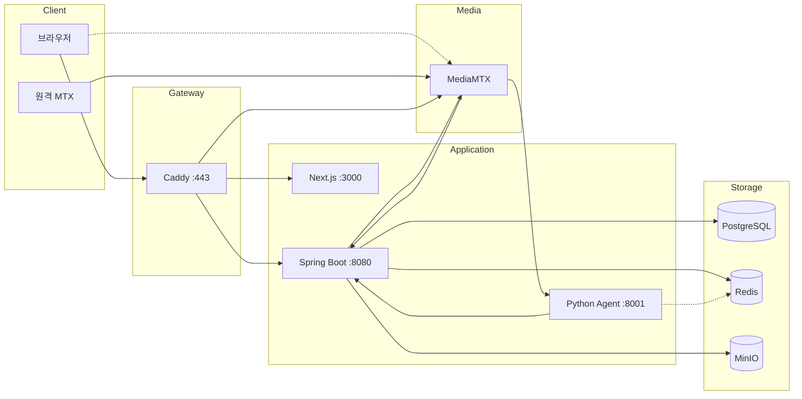

# 시스템 아키텍처

> AEGIS - CCTV 실시간 AI 안전 모니터링 시스템

---

## 전체 구성



---

## 서비스 포트

| 서비스 | 포트 | 설명 |
|--------|------|------|
| Caddy | 443 | HTTPS 리버스 프록시 |
| Next.js | 3000 | 프론트엔드 |
| Spring Boot | 8080 | 백엔드 API |
| Python Agent | 8001 | AI 분석 |
| PostgreSQL | 5432 | 데이터베이스 |
| Redis | 6379 | 캐시/토큰/Pub-Sub |
| MinIO | 9000 | 클립 스토리지 |
| MinIO Console | 9001 | 웹 관리 콘솔 |

### MediaMTX 포트

| 프로토콜 | 포트 | 용도 |
|----------|------|------|
| SRT | 8890/udp | 원격 MTX에서 스트림 수신 |
| WebRTC WHEP | 8889 | 시그널링 |
| WebRTC ICE | 8189/udp | 미디어 |
| HLS | 8888 | Spring 클립 추출용 (내부) |
| RTSP | 8554 | Python Agent 프레임 캡처용 (내부) |
| API | 9997 | 카메라 목록 조회 |

---

## Caddy 라우팅

| 경로 | 대상 |
|------|------|
| `/api/*` | Spring Boot :8080 |
| `/stream/*` | MediaMTX :8889 (prefix strip) |
| `/*` | Next.js :3000 |

---

## 연결 흐름

### 브라우저 → 백엔드

1. 브라우저 → Caddy (HTTPS :443)
2. Caddy → Next.js (`/*`) 또는 Spring Boot (`/api/*`)

### WebRTC 스트리밍

1. 브라우저 → Spring Boot: `GET /api/cameras` → 카메라 목록 + streamUrl 반환
2. 브라우저 → MediaMTX: `POST /stream/{cam}/whep` + `Authorization: Basic base64(_:jwt)`
3. MediaMTX → Spring Boot: `POST /internal/mediamtx/auth` (password=jwt)
4. Spring Boot: JWT 검증 → 카메라 접근 권한 확인
5. 브라우저 ↔ MediaMTX: UDP ICE 직접 연결 (DTLS 암호화)

### 카메라 동기화

1. 원격 MTX → MediaMTX: SRT 스트림 송출
2. MediaMTX: `runOnReady` 훅 실행
3. MediaMTX → Spring Boot: `POST /internal/mediamtx/sync`
4. Spring Boot → MediaMTX: `GET /v3/paths/list`
5. Spring Boot → PostgreSQL: 카메라 INSERT/UPDATE
6. Spring Boot → Redis: 분석 카메라 목록 저장 (`analysis:cameras`)
7. Spring Boot → Redis: Pub/Sub `camera:analysis:update` 발행
8. Spring Boot → 브라우저: SSE `camera` 이벤트

### AI 분석

1. Agent: Redis `camera:analysis:update` 채널 구독
2. Agent: Redis에서 분석 카메라 목록 조회 (`GET analysis:cameras`)
3. Agent: RTSP로 MediaMTX에 직접 연결 (`rtsp://localhost:8554/{cam}`, 인증 없음)
4. Agent: 1fps 캡처, 640x360 리사이즈, 8프레임 버퍼링
5. Agent: AI 분석 수행
6. Agent → Spring Boot: `POST /internal/agent/events` → Event (클립 자동 추출 포함)
7. Agent → Spring Boot: `PATCH /internal/agent/events/{id}/analysis`

---

## 인증

### SecurityConfig 규칙

| 경로 | 권한 |
|------|------|
| `/api/auth/login` | 인증 불필요 |
| `/api/auth/signup` | 인증 불필요 |
| `/api/auth/refresh` | 인증 불필요 |
| `/internal/**` | 인증 불필요 (내부망) |
| `/api/users/**` | ADMIN 역할 필요 |
| 그 외 | 인증 필요 |

### JWT 설정

| 설정 | 값 |
|------|-----|
| Access Token TTL | 15분 (900000ms) |
| Refresh Token TTL | 7일 (604800000ms) |
| 알고리즘 | HS256 |
| 저장소 | Access: 메모리, Refresh: Redis + HttpOnly Cookie |

### 인증 흐름

1. 로그인 → Access Token (응답 body) + Refresh Token (Redis + Cookie)
2. API 호출 → `Authorization: Bearer {accessToken}`
3. 401 응답 → Refresh Token으로 갱신 시도
4. 갱신 실패 → `/auth`로 리다이렉트

---

## MediaMTX 설정

### HLS 클립 추출 설정

| 설정 | 값 | 설명 |
|------|-----|------|
| hlsSegmentCount | 10 | 유지 세그먼트 수 |
| hlsSegmentDuration | 3s | 세그먼트 길이 |
| hlsSegmentMaxSize | 50M | 세그먼트 최대 크기 |
| hlsDirectory | /recordings | 저장 경로 |
| hlsVariant | fmp4 | Fragmented MP4 (FFmpeg 변환 용이) |

→ 3초 × 10개 = 최근 30초 보관 (Spring에서 이벤트 발생 시 클립 추출)

### 인증

모든 인증을 Spring Boot로 위임하여 통합 관리합니다.

**MediaMTX → Spring 인증 요청:**

```
POST /internal/mediamtx/auth
Content-Type: application/json

{
  "user": "사용자명",
  "password": "비밀번호 또는 JWT",
  "action": "publish | read",
  "path": "카메라 경로",
  "protocol": "srt | rtsp | hls | webrtc"
}
```

**프로토콜별 인증 처리:**

| 프로토콜 | action | 인증 방식 | 설명 |
|----------|--------|----------|------|
| SRT | publish | ID/PW | 환경변수 `MEDIAMTX_SRT_USER`, `MEDIAMTX_SRT_PASSWORD` |
| RTSP | read | 없음 | Python Agent 프레임 캡처용 (내부) |
| HLS | read | 없음 | Spring 클립 추출용 (내부) |
| WebRTC | read | JWT | Basic Auth password 필드에 JWT 전달 |

**SRT 인증 환경변수:**

| 환경변수 | 기본값 | 설명 |
|----------|--------|------|
| MEDIAMTX_SRT_USER | aegis | SRT 송출 사용자명 |
| MEDIAMTX_SRT_PASSWORD | trillion | SRT 송출 비밀번호 |

### 스트림 훅

**runOnReady (스트림 시작 시):**

- `curl -X POST /internal/mediamtx/sync` (동기화 트리거)

**runOnNotReady (스트림 종료 시):**

- `curl -X POST /internal/mediamtx/sync` (동기화 트리거)


### WebRTC 설정

| 설정 | 값 | 설명 |
|------|-----|------|
| webrtcICEHostNAT1To1IPs | [127.0.0.1] | ICE 후보 IP (개발용) |
| webrtcICEUDPMuxAddress | :8189 | UDP 멀티플렉싱 |

**주의:** H264 인코딩 시 B-frame 비활성화 필수 (`-tune zerolatency` 또는 `-profile:v baseline`)
