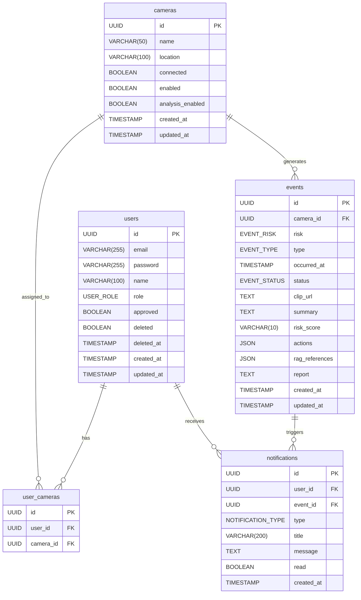

# 데이터 모델

> AEGIS - CCTV 실시간 AI 안전 모니터링 시스템

---

## ERD



---

## 테이블 상세

### users

| 타입 | 컬럼 | 제약조건 | NULL | 기본값 |
| ---- | ---- | -------- | ---- | ------ |
| UUID | id | PK | NO | auto |
| VARCHAR(255) | email | UNIQUE | NO | - |
| VARCHAR(255) | password | - | NO | - |
| VARCHAR(100) | name | - | NO | - |
| USER_ROLE | role | - | NO | USER |
| BOOLEAN | approved | - | NO | false |
| BOOLEAN | deleted | - | NO | false |
| TIMESTAMP | deleted_at | - | YES | - |
| TIMESTAMP | created_at | - | NO | auto |
| TIMESTAMP | updated_at | - | NO | auto |

### cameras

| 타입 | 컬럼 | 제약조건 | NULL | 기본값 |
| ---- | ---- | -------- | ---- | ------ |
| UUID | id | PK | NO | auto |
| VARCHAR(50) | name | UNIQUE | NO | - |
| VARCHAR(100) | location | - | NO | =name |
| BOOLEAN | connected | - | NO | false |
| BOOLEAN | enabled | - | NO | false |
| BOOLEAN | analysis_enabled | - | NO | false |
| TIMESTAMP | created_at | - | NO | auto |
| TIMESTAMP | updated_at | - | NO | auto |

### user_cameras

| 타입 | 컬럼 | 제약조건 | NULL | 기본값 |
| ---- | ---- | -------- | ---- | ------ |
| UUID | id | PK | NO | auto |
| UUID | user_id | FK(users.id), UK | NO | - |
| UUID | camera_id | FK(cameras.id), UK | NO | - |

> UK: user_id + camera_id 조합에 대한 유니크 제약조건

### events

| 타입 | 컬럼 | 제약조건 | NULL | 기본값 |
| ---- | ---- | -------- | ---- | ------ |
| UUID | id | PK | NO | auto |
| UUID | camera_id | FK(cameras.id) | NO | - |
| EVENT_RISK | risk | - | NO | - |
| EVENT_TYPE | type | - | NO | - |
| TIMESTAMP | occurred_at | - | NO | - |
| EVENT_STATUS | status | - | NO | PROCESSING |
| TEXT | clip_url | - | YES | - |
| TEXT | summary | - | YES | - |
| VARCHAR(10) | risk_score | - | YES | - |
| JSON | actions | - | YES | - |
| JSON | rag_references | - | YES | - |
| TEXT | report | - | YES | - |
| TIMESTAMP | created_at | - | NO | auto |
| TIMESTAMP | updated_at | - | NO | auto |

### notifications

| 타입 | 컬럼 | 제약조건 | NULL | 기본값 |
| ---- | ---- | -------- | ---- | ------ |
| UUID | id | PK | NO | auto |
| UUID | user_id | FK(users.id) | NO | - |
| UUID | event_id | FK(events.id) | YES | - |
| NOTIFICATION_TYPE | type | - | NO | - |
| VARCHAR(200) | title | - | NO | - |
| TEXT | message | - | NO | - |
| BOOLEAN | read | - | NO | false |
| TIMESTAMP | created_at | - | NO | auto |

---

## Enum 값

### UserRole

| 값 | API 값 | 설명 |
| -- | ------ | ---- |
| ADMIN | "admin" | 관리자 (모든 권한) |
| USER | "user" | 일반 사용자 (할당 카메라만) |

### EventRisk

| 값 | API 값 | 설명 |
| -- | ------ | ---- |
| NORMAL | "normal" | 정상 |
| SUSPICIOUS | "suspicious" | 의심 |
| ABNORMAL | "abnormal" | 이상 |

### EventType

| 값 | API 값 | 설명 |
| -- | ------ | ---- |
| ASSAULT | "assault" | 폭행 |
| BURGLARY | "burglary" | 절도 |
| DUMP | "dump" | 투기 |
| SWOON | "swoon" | 실신 |
| VANDALISM | "vandalism" | 파손 |

### EventStatus

| 값 | API 값 | 설명 |
| -- | ------ | ---- |
| PROCESSING | "processing" | 분석 중 |
| ANALYZED | "analyzed" | 분석 완료 |

### NotificationType

| 값 | API 값 | 설명 |
| -- | ------ | ---- |
| ALERT | "alert" | 긴급 |
| WARNING | "warning" | 경고 |
| INFO | "info" | 정보 |
| SUCCESS | "success" | 성공 |

---

## 인덱스

### users

- `idx_users_email` (email)
- `idx_users_approved` (approved)

### cameras

- `idx_cameras_connected` (connected)
- `idx_cameras_enabled` (enabled)
- `idx_cameras_analysis_enabled` (analysis_enabled)

### user_cameras

- `uk_user_cameras_user_camera` UNIQUE (user_id, camera_id)
- `idx_user_cameras_user_id` (user_id)
- `idx_user_cameras_camera_id` (camera_id)

### events

- `idx_events_camera_id` (camera_id)
- `idx_events_risk` (risk)
- `idx_events_type` (type)
- `idx_events_status` (status)
- `idx_events_occurred_at` (occurred_at)

### notifications

- `idx_notifications_user_id` (user_id)
- `idx_notifications_user_read` (user_id, read)
- `idx_notifications_created_at` (created_at)

---

## Redis 키

| 키 패턴 | 값 | TTL |
| ------- | -- | --- |
| `refresh_token:{token}` | userId | 7일 |
| `mediamtx:sync:lock` | "locked" | 1초 |
| `analysis:cameras` | JSON: [{id, name, location}, ...] | 없음 |

### Pub/Sub 채널

| 채널 | 메시지 | 구독자 |
| ---- | ------ | ------ |
| `camera:analysis:update` | "sync" | Python Agent |

---

## MinIO 버킷

```
files/
└── clips/
    └── {eventId}/
        └── clip.mp4
```

---

## 카메라 규칙

### 활성화 구조

- `enabled=false` → analysisEnabled도 자동 false
- `enabled=true, analysisEnabled=false` → 스트림만 표시
- `enabled=true, analysisEnabled=true` → 스트림 + AI 분석

### 정렬 순서

1. `connected` DESC (온라인 우선)
2. `enabled` DESC (활성화 우선)
3. `location` ASC (장소 이름순)
