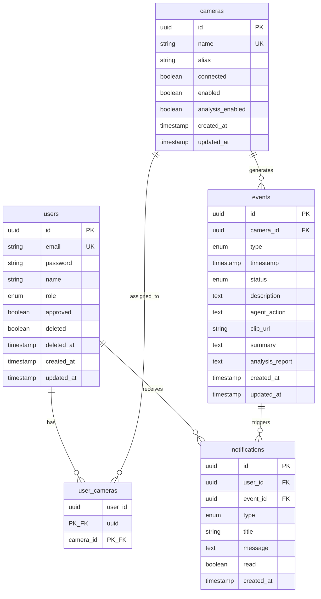

# 데이터 모델

> AEGIS - CCTV 실시간 AI 안전 모니터링 시스템

---

## ERD



---

## Enum 값

### UserRole

| 값 | API 값 | 설명 |
|-----|--------|------|
| ADMIN | "admin" | 관리자 (모든 권한) |
| USER | "user" | 일반 사용자 (할당 카메라만) |

### EventType

| 값 | API 값 | 설명 |
|-----|--------|------|
| ASSAULT | "assault" | 폭행 |
| BURGLARY | "burglary" | 절도 |
| DUMP | "dump" | 투기 |
| SWOON | "swoon" | 실신 |
| VANDALISM | "vandalism" | 파손 |

### EventStatus

| 값 | API 값 | 설명 |
|-----|--------|------|
| PROCESSING | "processing" | 분석 중 |
| RESOLVED | "resolved" | 완료 |

### NotificationType

| 값 | API 값 | 설명 |
|-----|--------|------|
| ALERT | "alert" | 긴급 (폭행, 절도) |
| WARNING | "warning" | 경고 (투기, 실신, 파손) |
| INFO | "info" | 정보 |
| SUCCESS | "success" | 성공 |

---

## 인덱스

### users

- `idx_users_email` (email)
- `idx_users_approved` (approved)

### cameras

- `idx_cameras_connected` (connected)
- `idx_cameras_enabled` (enabled)
- `idx_cameras_analysis_enabled` (analysis_enabled)

### events

- `idx_events_camera_id` (camera_id)
- `idx_events_type` (type)
- `idx_events_status` (status)
- `idx_events_timestamp` (timestamp)

### notifications

- `idx_notifications_user_id` (user_id)
- `idx_notifications_user_read` (user_id, read)
- `idx_notifications_created_at` (created_at)

---

## Redis 키

| 키 패턴 | 값 | TTL |
|---------|----|----|
| `refresh_token:{token}` | userId | 7일 |
| `stream_token:{token}` | userId:cameraId | 30초 |
| `mediamtx:sync:lock` | "locked" | 1초 |

### Pub/Sub 채널

| 채널 | 메시지 | 구독자 |
|------|--------|--------|
| `camera:analysis:update` | "update" | Python Agent |

---

## MinIO 버킷

```
files/
└── clips/
    └── {clipId}/
        └── clip.mp4
```

---

## 카메라 규칙

### 활성화 구조

- `enabled=false` → analysisEnabled도 자동 false
- `enabled=true, analysisEnabled=false` → 스트림만 표시
- `enabled=true, analysisEnabled=true` → 스트림 + AI 분석

### 정렬 순서

1. `connected` DESC (온라인 우선)
2. `enabled` DESC (활성화 우선)
3. `alias` ASC (별칭 이름순)
